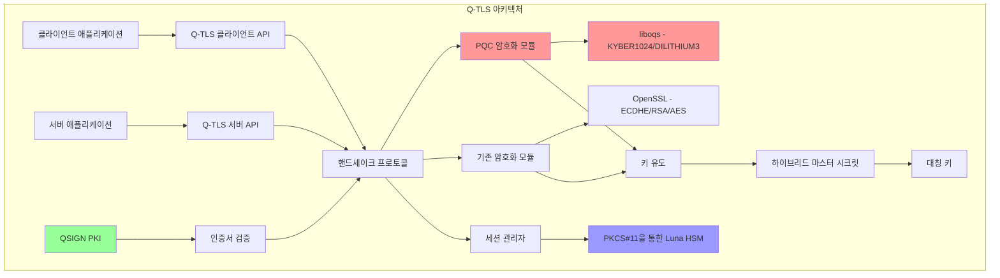
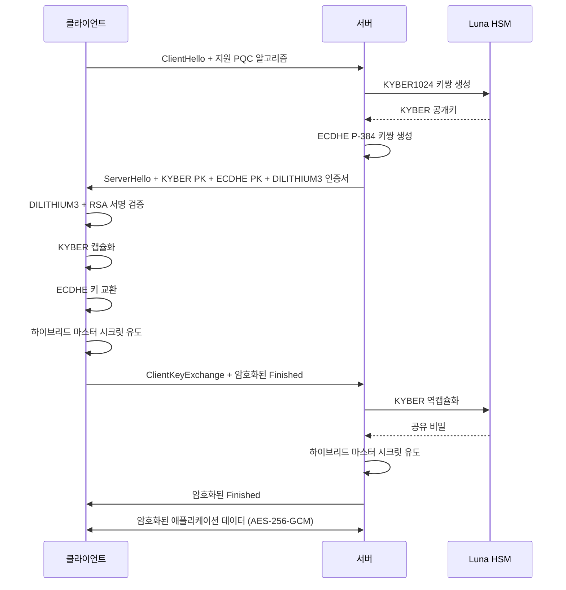

# Q-TLS: 양자 내성 전송 보안 계층

## 개요

Q-TLS(Quantum-resistant Transport Security Layer)는 양자 후 암호(PQC) 지원을 갖춘 프로덕션 환경용 TLS 구현입니다. 기존 알고리즘과 NIST 표준화 PQC 알고리즘을 결합한 하이브리드 암호화 보호를 제공하여 기존 및 양자 공격자 모두에 대한 보안을 보장합니다.

### 주요 기능

- **하이브리드 키 교환**: 전방향 비밀성을 위한 ECDHE P-384 + KYBER1024
- **이중 서명 방식**: 인증을 위한 RSA/ECDSA + DILITHIUM3
- **TLS 1.3 호환**: PQC 알고리즘 협상을 위한 확장
- **하드웨어 보안 모듈**: PKCS#11을 통한 Luna HSM 통합
- **FIPS 140-2 Level 3**: 준수 암호화 구현
- **QSIGN 통합**: QSIGN PKI 인프라와의 원활한 통합
- **프로덕션 준비**: 포괄적인 오류 처리 및 보안 감사

### 지원 알고리즘

**양자 후 알고리즘 (NIST 표준화):**
- **KEM**: KYBER1024 (ML-KEM-1024)
- **서명**: DILITHIUM3 (ML-DSA-65)

**기존 알고리즘:**
- **키 교환**: P-384 커브를 사용한 ECDHE
- **서명**: RSA-2048/4096, ECDSA P-384
- **대칭키**: AES-256-GCM, ChaCha20-Poly1305

## 아키텍처



### 하이브리드 핸드셰이크 흐름



## 빠른 시작

### 전제 조건

```bash
# 의존성 설치
sudo apt-get update
sudo apt-get install -y \
    build-essential \
    cmake \
    git \
    libssl-dev \
    astyle \
    doxygen

# liboqs (Open Quantum Safe) 설치
git clone https://github.com/open-quantum-safe/liboqs.git
cd liboqs
mkdir build && cd build
cmake -DCMAKE_INSTALL_PREFIX=/usr/local ..
make -j$(nproc)
sudo make install
sudo ldconfig
```

### Q-TLS 빌드

```bash
# 저장소 클론
cd /home/user/QSIGN/Q-TLS

# 빌드 디렉토리 생성
mkdir build && cd build

# CMake로 구성
cmake .. \
    -DCMAKE_BUILD_TYPE=Release \
    -DENABLE_HSM=ON \
    -DENABLE_TESTS=ON

# 빌드
make -j$(nproc)

# 테스트 실행
make test

# 설치
sudo make install
```

### 사용 예제

#### 서버 예제

```c
#include <qtls/qtls.h>

int main() {
    QTLS_CTX *ctx;
    QTLS_CONNECTION *conn;
    int ret;

    // Q-TLS 컨텍스트 초기화
    ctx = qtls_ctx_new(QTLS_SERVER_MODE);
    if (!ctx) {
        fprintf(stderr, "Q-TLS 컨텍스트 생성 실패\n");
        return 1;
    }

    // 인증서 체인 로드 (RSA + DILITHIUM3)
    ret = qtls_ctx_use_certificate_file(ctx,
        "/etc/qtls/server-cert.pem",
        QTLS_FILETYPE_PEM);

    // HSM에서 개인키 로드
    ret = qtls_ctx_use_hsm_key(ctx,
        "pkcs11:token=luna;object=qtls-server-key");

    // 하이브리드 모드 활성화
    qtls_ctx_set_options(ctx, QTLS_OP_HYBRID_MODE);

    // 리스닝 소켓 생성
    int listen_fd = create_server_socket(8443);

    while (1) {
        int client_fd = accept(listen_fd, NULL, NULL);

        // Q-TLS 연결 생성
        conn = qtls_new(ctx);
        qtls_set_fd(conn, client_fd);

        // 하이브리드 핸드셰이크 수행
        ret = qtls_accept(conn);
        if (ret != QTLS_SUCCESS) {
            fprintf(stderr, "핸드셰이크 실패: %s\n",
                qtls_get_error_string(ret));
            qtls_free(conn);
            continue;
        }

        // 암호화된 데이터 읽기
        char buf[4096];
        int n = qtls_read(conn, buf, sizeof(buf));

        // 암호화된 응답 전송
        qtls_write(conn, "Hello from Q-TLS!", 17);

        // 정리
        qtls_shutdown(conn);
        qtls_free(conn);
        close(client_fd);
    }

    qtls_ctx_free(ctx);
    return 0;
}
```

#### 클라이언트 예제

```c
#include <qtls/qtls.h>

int main() {
    QTLS_CTX *ctx;
    QTLS_CONNECTION *conn;
    int ret;

    // Q-TLS 컨텍스트 초기화
    ctx = qtls_ctx_new(QTLS_CLIENT_MODE);

    // 신뢰할 수 있는 CA 인증서 로드
    qtls_ctx_load_verify_locations(ctx,
        "/etc/qtls/ca-bundle.pem", NULL);

    // 하이브리드 모드 활성화
    qtls_ctx_set_options(ctx, QTLS_OP_HYBRID_MODE);

    // 서버 연결
    int sock_fd = connect_to_server("server.example.com", 8443);

    // Q-TLS 연결 생성
    conn = qtls_new(ctx);
    qtls_set_fd(conn, sock_fd);

    // 하이브리드 핸드셰이크 수행
    ret = qtls_connect(conn);
    if (ret != QTLS_SUCCESS) {
        fprintf(stderr, "핸드셰이크 실패: %s\n",
            qtls_get_error_string(ret));
        return 1;
    }

    // 서버 인증서 검증
    if (!qtls_verify_peer_certificate(conn)) {
        fprintf(stderr, "인증서 검증 실패\n");
        return 1;
    }

    // 암호화된 데이터 전송
    qtls_write(conn, "Hello Q-TLS!", 12);

    // 응답 읽기
    char buf[4096];
    int n = qtls_read(conn, buf, sizeof(buf));
    printf("수신: %.*s\n", n, buf);

    // 정리
    qtls_shutdown(conn);
    qtls_free(conn);
    qtls_ctx_free(ctx);

    return 0;
}
```

## QSIGN 통합

Q-TLS는 QSIGN 양자 내성 PKI 인프라와 원활하게 통합됩니다:

### 인증서 체인 검증

```c
// QSIGN CA 인증서 로드
qtls_ctx_load_verify_locations(ctx,
    "/etc/qsign/ca/root-ca-hybrid.pem", NULL);

// QSIGN 인증서 검증 활성화
qtls_ctx_set_verify_mode(ctx,
    QTLS_VERIFY_PEER | QTLS_VERIFY_FAIL_IF_NO_PEER_CERT);

// 인증서 검증 콜백 설정
qtls_ctx_set_verify_callback(ctx, qsign_cert_verify_callback);
```

### HSM 키 저장소

Q-TLS는 안전한 키 저장을 위해 Luna HSM을 사용합니다:

```c
// HSM 연결 초기화
ret = qtls_hsm_init("pkcs11:/usr/lib/libCryptoki2_64.so");

// HSM에서 서버 키 로드
ret = qtls_ctx_use_hsm_key(ctx,
    "pkcs11:token=luna;object=qtls-server-dilithium3;type=private");

// HSM에서 임시 KYBER 키 생성
ret = qtls_generate_ephemeral_key_hsm(conn, QTLS_KEM_KYBER1024);
```

### 인증서 형식

Q-TLS는 기존 키와 PQC 키를 모두 포함하는 하이브리드 인증서를 사용합니다:

```
인증서:
    데이터:
        버전: 3 (0x2)
        일련번호: 0x1234567890abcdef
        서명 알고리즘: dilithium3-rsa-hybrid
        발급자: CN=QSIGN Root CA
        유효기간
            시작: Jan  1 00:00:00 2025 GMT
            종료: Dec 31 23:59:59 2026 GMT
        주체: CN=qtls.example.com
        주체 공개키 정보:
            공개키 알고리즘: hybrid
                기존: rsaEncryption (2048 bit)
                PQC: dilithium3 (1952 bytes)
        X509v3 확장:
            X509v3 키 사용: critical
                디지털 서명, 키 암호화
            X509v3 확장 키 사용:
                TLS 웹 서버 인증
            PQC 알고리즘 식별자:
                KEM: kyber1024
                서명: dilithium3
```

## 디렉토리 구조

```
Q-TLS/
├── CMakeLists.txt              # 빌드 구성
├── README.md                   # 이 파일
├── LICENSE                     # Apache 2.0 라이선스
├── include/
│   └── qtls/
│       ├── qtls.h              # 메인 API 헤더
│       ├── crypto.h            # 암호화 기본 요소
│       ├── protocol.h          # 프로토콜 정의
│       └── errors.h            # 오류 코드
├── src/
│   ├── crypto/
│   │   ├── pqc_crypto.c        # PQC 구현 (KYBER/DILITHIUM)
│   │   ├── classical_crypto.c  # 기존 암호화 (ECDHE/RSA)
│   │   ├── hybrid_kdf.c        # 하이브리드 키 유도
│   │   └── hsm_interface.c     # Luna HSM PKCS#11 인터페이스
│   ├── protocol/
│   │   ├── handshake.c         # TLS-PQC 핸드셰이크
│   │   ├── record.c            # 레코드 계층
│   │   └── extensions.c        # PQC 확장
│   ├── server/
│   │   └── qtls_server.c       # 서버 구현
│   ├── client/
│   │   └── qtls_client.c       # 클라이언트 구현
│   └── core/
│       ├── context.c           # 컨텍스트 관리
│       ├── session.c           # 세션 관리
│       └── utils.c             # 유틸리티 함수
├── tests/
│   ├── test_crypto.c           # 암호화 단위 테스트
│   ├── test_handshake.c        # 핸드셰이크 테스트
│   └── test_integration.c      # 통합 테스트
├── examples/
│   ├── simple_server.c
│   ├── simple_client.c
│   └── hsm_server.c
└── docs/
    ├── API.md                  # API 문서
    ├── SECURITY.md             # 보안 고려사항
    └── DEPLOYMENT.md           # 배포 가이드
```

## 빌드 구성 옵션

| 옵션 | 기본값 | 설명 |
|--------|---------|-------------|
| `ENABLE_HSM` | OFF | PKCS#11을 통한 Luna HSM 지원 활성화 |
| `ENABLE_TESTS` | ON | 테스트 스위트 빌드 |
| `ENABLE_EXAMPLES` | ON | 예제 프로그램 빌드 |
| `FIPS_MODE` | OFF | FIPS 140-2 준수 모드 활성화 |
| `ENABLE_LOGGING` | ON | 상세 로깅 활성화 |
| `CMAKE_BUILD_TYPE` | Release | 빌드 타입 (Debug/Release) |

예제:
```bash
cmake .. \
    -DCMAKE_BUILD_TYPE=Release \
    -DENABLE_HSM=ON \
    -DFIPS_MODE=ON \
    -DENABLE_TESTS=ON
```

## 성능 벤치마크

Intel Xeon E5-2690 v4 @ 2.60GHz에서 테스트:

| 작업 | 시간 (ms) | 처리량 |
|-----------|-----------|------------|
| KYBER1024 키 생성 | 0.05 | 20,000 ops/sec |
| KYBER1024 캡슐화 | 0.07 | 14,285 ops/sec |
| KYBER1024 역캡슐화 | 0.08 | 12,500 ops/sec |
| DILITHIUM3 서명 | 0.85 | 1,176 ops/sec |
| DILITHIUM3 검증 | 0.12 | 8,333 ops/sec |
| 하이브리드 핸드셰이크 | 2.5 | 400 handshakes/sec |
| AES-256-GCM (16KB) | 0.02 | 800 MB/sec |

## 보안 고려사항

### 양자 내성

Q-TLS는 다음을 통해 양자 내성을 제공합니다:

1. **하이브리드 접근**: 기존 및 PQC 알고리즘 결합
2. **NIST 표준**: NIST 표준화 PQC 알고리즘만 사용
3. **전방향 비밀성**: 각 세션에 대한 임시 KYBER 키
4. **심층 방어**: 다중 계층 암호화 보호

### FIPS 140-2 준수

`-DFIPS_MODE=ON`으로 빌드 시:

- FIPS 검증 암호화 모듈 사용
- FIPS 승인 알고리즘 적용
- 필수 자체 테스트 구현
- 감사 로그 유지
- Luna HSM (FIPS 140-2 Level 3 인증) 통합

### 부채널 공격 보호

- 중요 작업에 대한 상수 시간 구현
- 민감한 데이터에 대한 보호된 메모리 할당
- 사용 후 안전한 키 삭제
- 장기 키에 대한 HSM 기반 키 저장소

## 테스트

### 단위 테스트

```bash
cd build
make test

# 특정 테스트 스위트 실행
./tests/test_crypto
./tests/test_handshake
./tests/test_integration
```

### 통합 테스트

```bash
# 테스트 서버 시작
./examples/simple_server &

# 클라이언트 테스트 실행
./examples/simple_client localhost 8443

# 로그 확인
tail -f /var/log/qtls/qtls.log
```

### 보안 테스트

```bash
# 정적 분석 실행
make static-analysis

# 메모리 누수 확인
valgrind --leak-check=full ./tests/test_integration

# 퍼징
make fuzz
```

## API 문서

전체 API 참조는 [docs/API.md](docs/API.md)를 참조하세요.

### 핵심 함수

- `qtls_ctx_new()` - 새 컨텍스트 생성
- `qtls_new()` - 새 연결 생성
- `qtls_connect()` - 클라이언트 핸드셰이크
- `qtls_accept()` - 서버 핸드셰이크
- `qtls_read()` - 암호화된 데이터 읽기
- `qtls_write()` - 암호화된 데이터 쓰기
- `qtls_shutdown()` - 연결 종료
- `qtls_free()` - 연결 리소스 해제

## 문제 해결

### 일반적인 문제

**핸드셰이크 실패:**
```
오류: QTLS_ERROR_HANDSHAKE_FAILED
해결책: 서버 인증서 체인을 확인하고 PQC 알고리즘이 지원되는지 확인
```

**HSM 연결 실패:**
```
오류: QTLS_ERROR_HSM_NOT_AVAILABLE
해결책: Luna HSM이 구성되어 있고 PKCS#11 라이브러리 경로가 올바른지 확인
```

**인증서 검증 실패:**
```
오류: QTLS_ERROR_CERT_VERIFY_FAILED
해결책: QSIGN CA 인증서가 로드되어 있고 인증서 체인이 유효한지 확인
```

## 기여

기여를 환영합니다! 다음 지침을 따라주세요:

1. 기존 코드 스타일 따르기
2. 새로운 기능에 대한 단위 테스트 추가
3. 문서 업데이트
4. 모든 테스트 통과 확인
5. 상세한 설명과 함께 풀 리퀘스트 제출

## 라이선스

Copyright 2025 QSIGN Project

Licensed under the Apache License, Version 2.0 (the "License");
you may not use this file except in compliance with the License.
You may obtain a copy of the License at

    http://www.apache.org/licenses/LICENSE-2.0

Unless required by applicable law or agreed to in writing, software
distributed under the License is distributed on an "AS IS" BASIS,
WITHOUT WARRANTIES OR CONDITIONS OF ANY KIND, either express or implied.
See the License for the specific language governing permissions and
limitations under the License.

## 연락처

- 프로젝트 웹사이트: https://github.com/QSIGN/Q-TLS
- 이슈 트래커: https://github.com/QSIGN/Q-TLS/issues
- 보안 문제: security@qsign.org

## 감사의 말

- Open Quantum Safe (liboqs) - https://openquantumsafe.org/
- NIST Post-Quantum Cryptography - https://csrc.nist.gov/projects/post-quantum-cryptography
- OpenSSL Project - https://www.openssl.org/
- Thales Luna HSM - https://cpl.thalesgroup.com/

## 참고 자료

1. NIST FIPS 203: Module-Lattice-Based Key-Encapsulation Mechanism (ML-KEM)
2. NIST FIPS 204: Module-Lattice-Based Digital Signature Algorithm (ML-DSA)
3. RFC 8446: The Transport Layer Security (TLS) Protocol Version 1.3
4. PKCS #11 v2.40: Cryptographic Token Interface Standard
