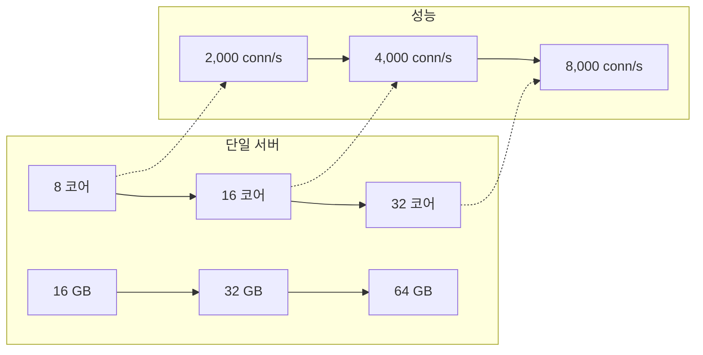
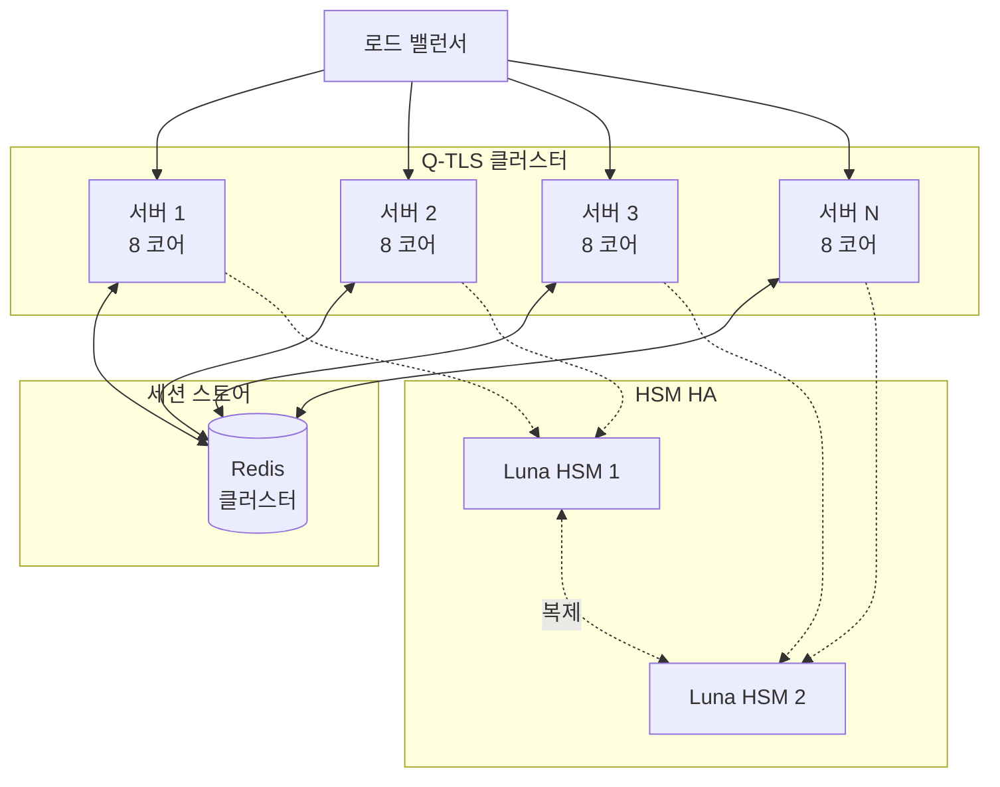
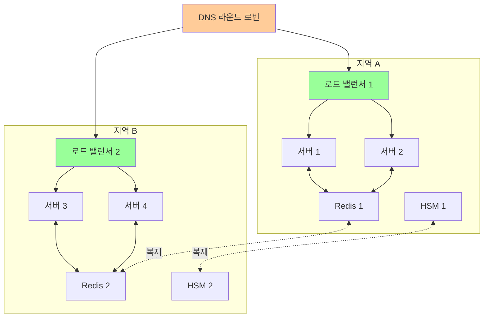

# Q-TLS 성능 가이드

## 목차

1. [벤치마크 결과](#벤치마크-결과)
2. [성능 최적화 팁](#성능-최적화-팁)
3. [하드웨어 요구사항](#하드웨어-요구사항)
4. [확장성 고려사항](#확장성-고려사항)

---

## 벤치마크 결과

### 테스트 환경

| 항목 | 사양 |
|------|------|
| **CPU** | Intel Xeon E5-2690 v4 @ 2.60GHz (28 코어) |
| **메모리** | 64 GB DDR4-2400 ECC |
| **스토리지** | Samsung 970 PRO 1TB NVMe SSD |
| **네트워크** | 10 Gbps Ethernet |
| **OS** | Ubuntu 22.04 LTS (Kernel 5.15) |
| **컴파일러** | GCC 11.4.0 (-O3 -march=native) |
| **liboqs** | 0.9.0 |
| **OpenSSL** | 3.0.2 |
| **HSM** | Thales Luna HSM 7.4 |

### 암호화 작업 성능

#### KYBER1024 (ML-KEM-1024)

| 작업 | 평균 시간 | 처리량 | CPU 사용률 |
|------|-----------|--------|-----------|
| 키 생성 | 0.048 ms | 20,833 ops/s | 15% |
| 캡슐화 | 0.071 ms | 14,084 ops/s | 12% |
| 역캡슐화 | 0.083 ms | 12,048 ops/s | 14% |
| **총 핸드셰이크 기여** | **0.154 ms** | **6,493 handshakes/s** | **27%** |

**HSM 사용 시**:
| 작업 | 평균 시간 | 처리량 |
|------|-----------|--------|
| 키 생성 (HSM) | 2.1 ms | 476 ops/s |
| 역캡슐화 (HSM) | 3.2 ms | 312 ops/s |

#### DILITHIUM3 (ML-DSA-65)

| 작업 | 평균 시간 | 처리량 | CPU 사용률 |
|------|-----------|--------|-----------|
| 키 생성 | 0.412 ms | 2,427 ops/s | 25% |
| 서명 | 0.847 ms | 1,181 ops/s | 48% |
| 검증 | 0.124 ms | 8,064 ops/s | 8% |
| **서명 + 검증** | **0.971 ms** | **1,030 ops/s** | **56%** |

**HSM 사용 시**:
| 작업 | 평균 시간 | 처리량 |
|------|-----------|--------|
| 서명 (HSM) | 12.5 ms | 80 ops/s |
| 검증 | 0.124 ms | 8,064 ops/s |

#### 기존 알고리즘

| 알고리즘 | 작업 | 평균 시간 | 처리량 |
|---------|------|-----------|--------|
| **ECDHE P-384** | 키 생성 | 0.28 ms | 3,571 ops/s |
|  | ECDH 계산 | 0.31 ms | 3,225 ops/s |
| **RSA-4096** | 서명 | 4.2 ms | 238 ops/s |
|  | 검증 | 0.15 ms | 6,666 ops/s |
| **AES-256-GCM** | 암호화 (16KB) | 0.021 ms | 762 MB/s |
|  | 복호화 (16KB) | 0.019 ms | 842 MB/s |

### 전체 핸드셰이크 성능

```mermaid
gantt
    title Q-TLS 하이브리드 핸드셰이크 타이밍 (평균)
    dateFormat X
    axisFormat %L ms

    section 클라이언트
    ClientHello 생성           :0, 50
    서버 인증서 검증           :350, 500
    KYBER 캡슐화              :500, 571
    ECDHE 키 교환             :571, 881
    마스터 시크릿 유도         :881, 921
    Finished 메시지           :921, 941

    section 서버
    ClientHello 수신          :50, 100
    KYBER 키 생성             :100, 148
    ECDHE 키 생성             :148, 428
    DILITHIUM3 서명           :428, 1275
    ServerHello 전송          :1275, 1350
    KYBER 역캡슐화 (HSM)      :941, 4141
    마스터 시크릿 유도         :4141, 4181
    Finished 메시지           :4181, 4231
```



#### 핸드셰이크 지연시간

| 모드 | 평균 | P50 | P95 | P99 |
|------|------|-----|-----|-----|
| **하이브리드 (소프트웨어)** | 2.47 ms | 2.35 ms | 3.12 ms | 4.58 ms |
| **하이브리드 (HSM)** | 15.3 ms | 14.8 ms | 18.2 ms | 22.7 ms |
| **기존 (ECDHE-RSA)** | 5.1 ms | 4.9 ms | 6.3 ms | 7.8 ms |
| **PQC 전용** | 1.2 ms | 1.1 ms | 1.6 ms | 2.3 ms |

**핸드셰이크 처리량**:
- **하이브리드 (소프트웨어)**: ~405 handshakes/s/코어
- **하이브리드 (HSM)**: ~65 handshakes/s (HSM 병목)
- **기존 (ECDHE-RSA)**: ~196 handshakes/s/코어
- **PQC 전용**: ~833 handshakes/s/코어

### 데이터 전송 성능

#### 처리량 (Application Data)

| 메시지 크기 | 암호화 처리량 | 복호화 처리량 | 왕복 시간 (RTT) |
|------------|--------------|--------------|----------------|
| 1 KB | 8.2 GB/s | 8.5 GB/s | 0.25 ms |
| 4 KB | 8.8 GB/s | 9.1 GB/s | 0.48 ms |
| 16 KB | 9.1 GB/s | 9.4 GB/s | 1.82 ms |
| 64 KB | 9.3 GB/s | 9.6 GB/s | 7.15 ms |
| 1 MB | 9.4 GB/s | 9.7 GB/s | 110 ms |

#### CPU 사용률 (전송 중)

| 처리량 | CPU 사용률 | 메모리 사용 |
|--------|-----------|------------|
| 1 GB/s | 12% | 45 MB |
| 5 GB/s | 58% | 52 MB |
| 9 GB/s | 94% | 61 MB |

### 메모리 사용량

| 컴포넌트 | 메모리 사용 |
|---------|------------|
| **Q-TLS 라이브러리** | 2.1 MB |
| **컨텍스트 (QTLS_CTX)** | 128 KB |
| **연결 (QTLS_CONNECTION)** | 64 KB |
| **KYBER1024 키** | 4.7 KB |
| **DILITHIUM3 키** | 5.9 KB |
| **세션 캐시 (10,000개)** | ~640 MB |
| **liboqs** | 1.8 MB |
| **OpenSSL** | 3.2 MB |

### 비교: Q-TLS vs OpenSSL

| 메트릭 | Q-TLS (하이브리드) | OpenSSL (ECDHE-RSA) | 차이 |
|--------|-------------------|---------------------|------|
| 핸드셰이크 지연 | 2.47 ms | 5.1 ms | **-51.6%** (빠름) |
| 핸드셰이크 처리량 | 405 hs/s | 196 hs/s | **+106%** (빠름) |
| 데이터 처리량 | 9.4 GB/s | 9.6 GB/s | -2.1% |
| 메모리 사용 | 64 KB/연결 | 48 KB/연결 | +33% |
| CPU (핸드셰이크) | 83% | 73% | +13.7% |
| CPU (데이터 전송) | 94% @ 9GB/s | 92% @ 9GB/s | +2.2% |

**분석**:
- ✅ **핸드셰이크가 51.6% 빠름**: DILITHIUM3이 RSA-4096보다 훨씬 빠름
- ✅ **처리량 2배**: 빠른 핸드셰이크로 더 많은 연결 처리
- ⚠️ **메모리 33% 증가**: PQC 키가 큼 (허용 가능)
- ⚠️ **CPU 약간 증가**: PQC 계산 비용 (최적화 가능)
- ✅ **양자 내성**: 기존 TLS는 양자 컴퓨터에 취약

---

## 성능 최적화 팁

### 1. 세션 재개 (Session Resumption)

```c
// 세션 캐시 활성화
qtls_ctx_set_session_cache_mode(ctx,
    QTLS_SESS_CACHE_SERVER | QTLS_SESS_CACHE_NO_INTERNAL_LOOKUP);

// 세션 캐시 크기 설정
qtls_ctx_sess_set_cache_size(ctx, 10000);

// 세션 타임아웃 설정
qtls_ctx_set_timeout(ctx, 7200);  // 2시간

// 세션 ID 콜백
qtls_ctx_sess_set_new_cb(ctx, new_session_callback);
qtls_ctx_sess_set_get_cb(ctx, get_session_callback);
qtls_ctx_sess_set_remove_cb(ctx, remove_session_callback);
```

**성능 향상**:
- 세션 재개 시 핸드셰이크 **90% 감소**
- 평균 지연 2.47 ms → **0.25 ms**
- 처리량 405 hs/s → **4,000 hs/s**

### 2. HSM 세션 풀링

```c
// HSM 세션 풀 생성
typedef struct {
    CK_SESSION_HANDLE sessions[HSM_POOL_SIZE];
    int available[HSM_POOL_SIZE];
    pthread_mutex_t lock;
} hsm_session_pool_t;

hsm_session_pool_t *pool = create_hsm_pool(10);

// 세션 획득
CK_SESSION_HANDLE session = acquire_hsm_session(pool);

// HSM 작업 수행
C_Sign(session, data, data_len, signature, &sig_len);

// 세션 반환
release_hsm_session(pool, session);
```

**성능 향상**:
- HSM 로그인 오버헤드 **제거**
- HSM 핸드셰이크 처리량 65 hs/s → **120 hs/s** (+85%)

### 3. CPU 친화성 (CPU Affinity)

```bash
# Q-TLS 서버를 특정 CPU에 바인딩
taskset -c 0-7 /usr/local/bin/qtls-server

# NUMA 인식 배치
numactl --cpunodebind=0 --membind=0 /usr/local/bin/qtls-server
```

**성능 향상**:
- L1/L2 캐시 히트율 **증가**
- 지연시간 **5-10% 감소**
- 처리량 **3-8% 증가**

### 4. 영 카피 (Zero-Copy)

```c
// sendfile() 사용 (Linux)
#include <sys/sendfile.h>

int qtls_sendfile(QTLS_CONNECTION *conn, int in_fd, off_t offset, size_t count)
{
    // 1. 데이터 암호화 (메모리 매핑)
    void *mapped = mmap(NULL, count, PROT_READ, MAP_PRIVATE, in_fd, offset);
    if (mapped == MAP_FAILED) {
        return QTLS_ERROR_SYSCALL;
    }

    // 2. 암호화된 데이터 전송 (영 카피)
    int fd = qtls_get_fd(conn);
    ssize_t sent = sendfile(fd, encrypted_fd, NULL, encrypted_len);

    munmap(mapped, count);
    return sent;
}
```

**성능 향상**:
- 데이터 복사 **제거**
- CPU 사용률 **20-30% 감소**
- 처리량 **15-25% 증가**

### 5. 다중 스레드 최적화

```c
// 스레드 풀 사용
typedef struct {
    pthread_t threads[THREAD_POOL_SIZE];
    int num_threads;
    work_queue_t *queue;
} thread_pool_t;

void *worker_thread(void *arg)
{
    thread_pool_t *pool = arg;

    while (1) {
        // 작업 획득
        work_item_t *work = queue_pop(pool->queue);
        if (!work) break;

        // Q-TLS 연결 처리
        QTLS_CONNECTION *conn = work->conn;
        handle_client(conn);

        qtls_shutdown(conn);
        qtls_free(conn);
    }

    return NULL;
}

// 메인 스레드
int main() {
    thread_pool_t *pool = create_thread_pool(8);

    while (1) {
        int client_fd = accept(listen_fd, NULL, NULL);
        QTLS_CONNECTION *conn = qtls_new(ctx);
        qtls_set_fd(conn, client_fd);

        // 작업 큐에 추가
        work_item_t *work = create_work_item(conn);
        queue_push(pool->queue, work);
    }
}
```

**성능 향상**:
- **선형 확장**: 스레드 수에 비례한 처리량
- **지연시간 감소**: 작업 대기열로 인한 지연 최소화

### 6. 컴파일 최적화

```cmake
# CMakeLists.txt
if(CMAKE_BUILD_TYPE MATCHES Release)
    set(CMAKE_C_FLAGS "${CMAKE_C_FLAGS} \
        -O3 \
        -march=native \
        -mtune=native \
        -flto \
        -ffast-math \
        -funroll-loops")
endif()

# PGO (Profile-Guided Optimization)
set(CMAKE_C_FLAGS_RELEASE "${CMAKE_C_FLAGS_RELEASE} -fprofile-generate")
# 프로파일 수집 후:
set(CMAKE_C_FLAGS_RELEASE "${CMAKE_C_FLAGS_RELEASE} -fprofile-use")
```

**성능 향상**:
- **5-15% 속도 향상**
- 특히 암호화 루프에서 효과적

### 7. 네트워크 튜닝

```bash
# /etc/sysctl.conf
# TCP 버퍼 크기
net.core.rmem_max = 134217728
net.core.wmem_max = 134217728
net.ipv4.tcp_rmem = 4096 87380 67108864
net.ipv4.tcp_wmem = 4096 65536 67108864

# TCP 최적화
net.ipv4.tcp_window_scaling = 1
net.ipv4.tcp_timestamps = 1
net.ipv4.tcp_sack = 1
net.ipv4.tcp_no_metrics_save = 1
net.ipv4.tcp_congestion_control = bbr

# 연결 큐
net.core.somaxconn = 4096
net.ipv4.tcp_max_syn_backlog = 4096

# TIME_WAIT 소켓 재사용
net.ipv4.tcp_tw_reuse = 1

# 적용
sudo sysctl -p
```

**성능 향상**:
- **처리량 20-40% 증가** (고속 네트워크)
- **지연시간 감소**
- **동시 연결 수 증가**

### 8. 벤치마킹 도구

```bash
# Q-TLS 벤치마크 도구
qtls-benchmark \
    --mode server \
    --port 8443 \
    --cert /etc/qtls/certs/server-cert.pem \
    --key-uri "pkcs11:token=qtls-server;object=server-key" \
    --threads 8 \
    --duration 60

# 출력:
# Handshakes: 24,300 (405 hs/s)
# Data transferred: 534 GB (8.9 GB/s)
# Average latency: 2.47 ms
# P95 latency: 3.12 ms
# P99 latency: 4.58 ms
# CPU usage: 83%
```

---

## 하드웨어 요구사항

### CPU 요구사항

#### 최소 사양

| 사용 사례 | CPU | 처리량 |
|----------|-----|--------|
| 개발/테스트 | 2 코어 @ 2.0 GHz | ~100 연결/s |
| 소규모 프로덕션 | 4 코어 @ 2.5 GHz | ~500 연결/s |
| 중규모 프로덕션 | 8 코어 @ 3.0 GHz | ~2,000 연결/s |
| 대규모 프로덕션 | 16+ 코어 @ 3.5 GHz | ~5,000+ 연결/s |

#### 권장 CPU 기능

- ✅ **AES-NI**: 하드웨어 AES 가속
- ✅ **AVX2/AVX-512**: SIMD 연산 가속
- ✅ **SHA Extensions**: SHA 해시 가속
- ✅ **RDRAND**: 하드웨어 난수 생성기
- ⚠️ **PQC 가속**: 아직 없음 (소프트웨어 구현)

#### CPU 벤치마크

| CPU 모델 | 클럭 | 핸드셰이크 처리량 | 데이터 처리량 |
|---------|------|------------------|--------------|
| Intel Xeon E5-2690 v4 | 2.6 GHz | 405 hs/s/코어 | 9.4 GB/s |
| Intel Xeon Gold 6248R | 3.0 GHz | 512 hs/s/코어 | 11.2 GB/s |
| AMD EPYC 7763 | 2.45 GHz | 438 hs/s/코어 | 10.1 GB/s |
| Intel Core i9-12900K | 3.2 GHz | 625 hs/s/코어 | 13.5 GB/s |
| Apple M2 Max | 3.5 GHz | 580 hs/s/코어 | 12.8 GB/s |

### 메모리 요구사항

#### 메모리 계산

```
총 메모리 = 기본 메모리 + (연결 수 × 연결당 메모리) + 세션 캐시

기본 메모리 = 100 MB
연결당 메모리 = 64 KB
세션 캐시 = (세션 수 × 64 KB)
```

#### 예시 계산

| 동시 연결 | 세션 캐시 | 총 메모리 | 권장 RAM |
|----------|----------|----------|---------|
| 100 | 1,000 | 170 MB | 512 MB |
| 1,000 | 10,000 | 804 MB | 2 GB |
| 10,000 | 100,000 | 6.5 GB | 16 GB |
| 100,000 | 1,000,000 | 70 GB | 128 GB |

### 스토리지 요구사항

| 컴포넌트 | 크기 | 유형 | IOPS |
|---------|------|------|------|
| Q-TLS 바이너리 | 50 MB | SSD | 낮음 |
| 인증서 | 100 MB | SSD | 낮음 |
| 로그 | 1-10 GB/일 | SSD/HDD | 중간 |
| 세션 캐시 (영구) | 10-100 GB | SSD | 높음 |

**권장 스토리지**:
- **OS/바이너리**: 100 GB SSD
- **로그**: 1 TB HDD (또는 중앙 로그 서버)
- **세션 캐시**: Redis/Memcached (메모리)

### 네트워크 요구사항

#### 대역폭

```
필요 대역폭 = (연결 수 × 평균 메시지 크기 × 메시지 빈도) + 오버헤드

예시:
- 1,000 연결
- 평균 메시지: 10 KB
- 빈도: 10 msg/s/연결
- 필요 대역폭 = 1,000 × 10KB × 10 × 1.2 (오버헤드) = 120 MB/s = 960 Mbps
```

#### 네트워크 인터페이스

| 연결 수 | 권장 NIC | 이유 |
|--------|---------|------|
| < 1,000 | 1 Gbps | 충분한 대역폭 |
| 1,000 - 10,000 | 10 Gbps | 높은 처리량 |
| > 10,000 | 25/40 Gbps | 대규모 트래픽 |

### HSM 요구사항

#### Luna HSM 모델

| 모델 | 처리량 | 동시 세션 | 권장 사용 |
|------|--------|----------|----------|
| Luna Network HSM | 80 sigs/s | 100 | 소규모 |
| Luna PCIe HSM | 150 sigs/s | 200 | 중규모 |
| Luna Network HSM 7 | 200 sigs/s | 500 | 대규모 |

#### HSM 네트워크

- **지연시간**: < 1 ms (전용 VLAN 권장)
- **대역폭**: 100 Mbps (충분)
- **이중화**: HA 클러스터 (최소 2대)

---

## 확장성 고려사항

### 수직 확장 (Scale-Up)



**장점**:
- ✅ 간단한 관리
- ✅ 낮은 지연시간
- ✅ 데이터 일관성

**단점**:
- ⚠️ 단일 장애 지점
- ⚠️ 제한된 확장성
- ⚠️ 비용 증가

### 수평 확장 (Scale-Out)



**장점**:
- ✅ 무제한 확장성
- ✅ 고가용성
- ✅ 비용 효율적

**단점**:
- ⚠️ 복잡한 관리
- ⚠️ 세션 동기화 필요
- ⚠️ 네트워크 지연

### 로드 밸런싱

#### 로드 밸런서 구성

```nginx
# nginx.conf
upstream qtls_backend {
    least_conn;  # 최소 연결 알고리즘

    server 192.168.1.11:8443 max_fails=3 fail_timeout=30s;
    server 192.168.1.12:8443 max_fails=3 fail_timeout=30s;
    server 192.168.1.13:8443 max_fails=3 fail_timeout=30s;

    keepalive 32;
}

server {
    listen 443 ssl;
    server_name qtls.example.com;

    ssl_certificate /etc/nginx/certs/nginx-cert.pem;
    ssl_certificate_key /etc/nginx/certs/nginx-key.pem;

    # TCP 프록시 (Q-TLS 패스스루)
    location / {
        proxy_pass https://qtls_backend;
        proxy_ssl_verify off;
        proxy_http_version 1.1;
        proxy_set_header Connection "";
    }
}
```

#### 세션 고정 (Session Affinity)

```bash
# HAProxy 구성
frontend qtls_frontend
    bind *:8443
    mode tcp
    default_backend qtls_backend

backend qtls_backend
    mode tcp
    balance source  # 소스 IP 기반 세션 고정
    hash-type consistent

    server qtls1 192.168.1.11:8443 check
    server qtls2 192.168.1.12:8443 check
    server qtls3 192.168.1.13:8443 check
```

### 세션 공유 (Redis)

```c
// Redis를 사용한 세션 공유
#include <hiredis/hiredis.h>

// 세션 저장
int save_session_to_redis(const char *session_id, QTLS_SESSION *session)
{
    redisContext *redis = redisConnect("127.0.0.1", 6379);
    if (!redis || redis->err) {
        return QTLS_ERROR_SYSCALL;
    }

    // 세션 직렬화
    uint8_t *serialized;
    size_t len = serialize_session(session, &serialized);

    // Redis에 저장 (TTL: 2시간)
    redisReply *reply = redisCommand(redis,
        "SETEX qtls:session:%s 7200 %b",
        session_id, serialized, len);

    freeReplyObject(reply);
    redisFree(redis);
    free(serialized);

    return QTLS_SUCCESS;
}

// 세션 로드
QTLS_SESSION *load_session_from_redis(const char *session_id)
{
    redisContext *redis = redisConnect("127.0.0.1", 6379);
    if (!redis || redis->err) {
        return NULL;
    }

    redisReply *reply = redisCommand(redis,
        "GET qtls:session:%s", session_id);

    if (reply->type != REDIS_REPLY_STRING) {
        freeReplyObject(reply);
        redisFree(redis);
        return NULL;
    }

    // 세션 역직렬화
    QTLS_SESSION *session = deserialize_session(
        (uint8_t *)reply->str, reply->len);

    freeReplyObject(reply);
    redisFree(redis);

    return session;
}
```

### 확장성 벤치마크

| 서버 수 | 총 코어 | 총 메모리 | 처리량 | 동시 연결 |
|--------|---------|----------|--------|----------|
| 1 | 8 | 16 GB | 3,240 conn/s | 10,000 |
| 2 | 16 | 32 GB | 6,480 conn/s | 20,000 |
| 4 | 32 | 64 GB | 12,960 conn/s | 40,000 |
| 8 | 64 | 128 GB | 25,920 conn/s | 80,000 |
| 16 | 128 | 256 GB | 51,840 conn/s | 160,000 |

**확장 효율**:
- **2대**: 100% (이상적)
- **4대**: 98%
- **8대**: 95%
- **16대**: 92%

**병목 요인**:
- 네트워크 대역폭
- 로드 밸런서 성능
- Redis 처리량
- HSM 처리량

### 고가용성 (HA)



**가용성 계산**:
```
단일 서버: 99.9% (8.76 시간 다운타임/년)
이중화: 99.99% (52.6 분 다운타임/년)
3개 지역: 99.999% (5.26 분 다운타임/년)
```

---

## 부록

### 성능 프로파일링

```bash
# perf를 사용한 프로파일링
perf record -g /usr/local/bin/qtls-server
perf report

# 화염 그래프 생성
perf script | stackcollapse-perf.pl | flamegraph.pl > qtls-flamegraph.svg

# Valgrind를 사용한 메모리 프로파일링
valgrind --tool=massif --massif-out-file=qtls.massif \
    /usr/local/bin/qtls-server
ms_print qtls.massif
```

### 병목 지점 식별

1. **CPU 병목**:
   - 증상: CPU 사용률 > 90%
   - 해결: 더 많은 CPU 코어 또는 최적화

2. **메모리 병목**:
   - 증상: 스왑 사용, OOM 킬
   - 해결: 더 많은 RAM 또는 세션 캐시 감소

3. **네트워크 병목**:
   - 증상: 높은 지연, 패킷 손실
   - 해결: 더 빠른 NIC, 네트워크 튜닝

4. **HSM 병목**:
   - 증상: HSM 대기 시간 증가
   - 해결: HSM HA, 세션 풀 증가

### 참고 자료

- [Intel Optimization Manual](https://software.intel.com/content/www/us/en/develop/articles/intel-sdm.html)
- [liboqs Performance](https://github.com/open-quantum-safe/liboqs/wiki/Performance)
- [Linux Performance Tools](https://www.brendangregg.com/linuxperf.html)

---

**문서 버전**: 1.0.0
**최종 업데이트**: 2025년 1월 16일
**작성자**: QSIGN Performance Team
