# QSIGN 통합 가이드

## 목차

1. [개요](#개요)
2. [QSIGN 아키텍처](#qsign-아키텍처)
3. [QSIGN PKI 구조](#qsign-pki-구조)
4. [Q-TLS와 QSIGN 컴포넌트 통합](#q-tls와-qsign-컴포넌트-통합)
5. [단계별 배포 가이드](#단계별-배포-가이드)
6. [인증서 체인 설정](#인증서-체인-설정)
7. [HSM 키 관리](#hsm-키-관리)
8. [네트워크 설정](#네트워크-설정)
9. [모니터링 및 로깅](#모니터링-및-로깅)
10. [트러블슈팅](#트러블슈팅)

---

## 개요

QSIGN(Quantum-Safe Infrastructure for Global Network)은 양자 컴퓨팅 시대를 대비한 엔터프라이즈급 보안 인프라입니다. Q-TLS는 QSIGN의 핵심 컴포넌트로서 양자 내성 전송 계층 보안을 제공합니다.

### QSIGN 생태계

QSIGN은 다음 주요 컴포넌트로 구성됩니다:

- **Q-TLS**: 양자 내성 전송 보안 계층
- **Q-Gateway (APISIX)**: 양자 내성 API 게이트웨이
- **Q-Sign (Keycloak)**: 양자 내성 인증 및 접근 제어
- **Q-KMS (Vault)**: 양자 내성 키 관리 시스템
- **Luna HSM**: FIPS 140-2 Level 3 하드웨어 보안 모듈

### 핵심 기능

1. **하이브리드 암호화**: 기존 알고리즘(ECDHE, RSA)과 양자 후 알고리즘(KYBER1024, DILITHIUM3) 결합
2. **통합 PKI**: QSIGN CA를 통한 통합 인증서 관리
3. **HSM 기반 키 보호**: Luna HSM을 통한 안전한 키 저장
4. **완전한 상호운용성**: 모든 QSIGN 컴포넌트 간 원활한 통합

---

## QSIGN 아키텍처

### 전체 시스템 아키텍처

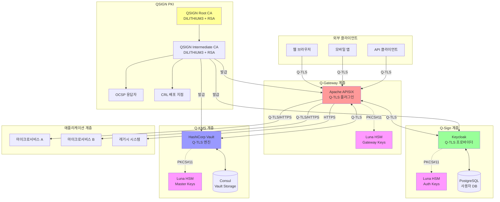

### 데이터 흐름

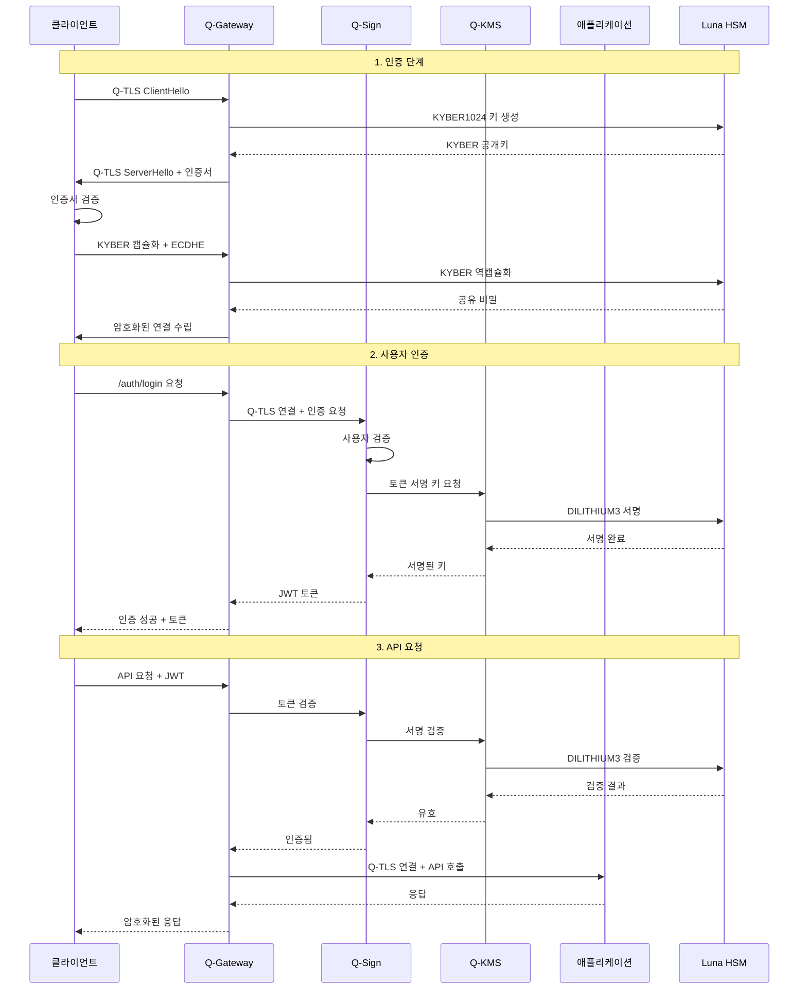

---

## QSIGN PKI 구조

### PKI 계층 구조

QSIGN PKI는 하이브리드 인증서를 사용하여 기존 및 양자 후 암호화를 모두 지원합니다.

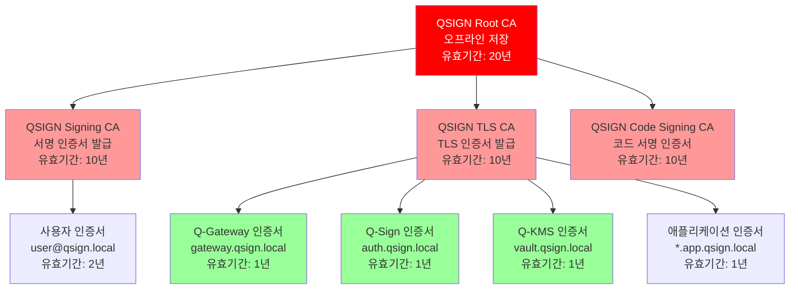

### 하이브리드 인증서 구조

QSIGN 인증서는 기존 및 양자 후 알고리즘을 모두 포함합니다:

```
Certificate:
    Data:
        Version: 3 (0x2)
        Serial Number: 0x1a2b3c4d5e6f7890
        Signature Algorithm: hybrid-dilithium3-rsa
        Issuer: CN=QSIGN Intermediate CA, O=QSIGN, C=KR
        Validity
            Not Before: Jan  1 00:00:00 2025 GMT
            Not After : Dec 31 23:59:59 2025 GMT
        Subject: CN=gateway.qsign.local, O=QSIGN, C=KR
        Subject Public Key Info:
            Public Key Algorithm: hybrid
                Classical Algorithm: rsaEncryption
                    Public-Key: (4096 bit)
                    Modulus: ...
                    Exponent: 65537 (0x10001)
                PQC Algorithm: dilithium3
                    Public-Key: (1952 bytes)
                    PQC-Public-Key: ...
        X509v3 extensions:
            X509v3 Key Usage: critical
                Digital Signature, Key Encipherment
            X509v3 Extended Key Usage:
                TLS Web Server Authentication, TLS Web Client Authentication
            X509v3 Subject Alternative Name:
                DNS:gateway.qsign.local, DNS:*.gateway.qsign.local
            X509v3 Subject Key Identifier:
                A1:B2:C3:D4:E5:F6:07:18:29:3A:4B:5C:6D:7E:8F:90
            X509v3 Authority Key Identifier:
                keyid:11:22:33:44:55:66:77:88:99:AA:BB:CC:DD:EE:FF:00
            X509v3 CRL Distribution Points:
                Full Name:
                  URI:http://crl.qsign.local/qsign-tls-ca.crl
            Authority Information Access:
                OCSP - URI:http://ocsp.qsign.local
                CA Issuers - URI:http://ca.qsign.local/qsign-tls-ca.crt
            PQC Algorithm Identifiers:
                KEM: kyber1024 (ML-KEM-1024)
                Signature: dilithium3 (ML-DSA-65)
    Signature Algorithm: hybrid-dilithium3-rsa
         Classical Signature (RSA-4096):
             ... (512 bytes)
         PQC Signature (DILITHIUM3):
             ... (3293 bytes)
```

### 인증서 발급 프로세스

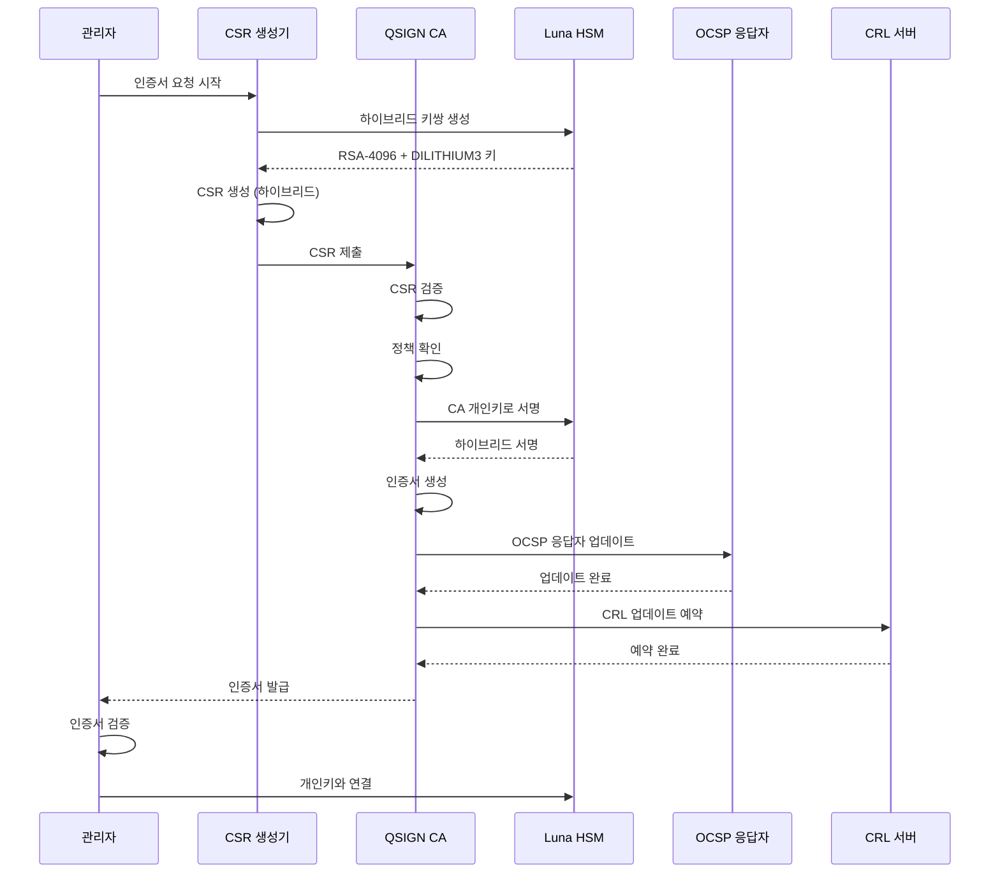

---

## Q-TLS와 QSIGN 컴포넌트 통합

### Q-Gateway (APISIX) 통합

Q-Gateway는 QSIGN의 엔트리 포인트로서 모든 외부 트래픽을 처리합니다.

#### 아키텍처

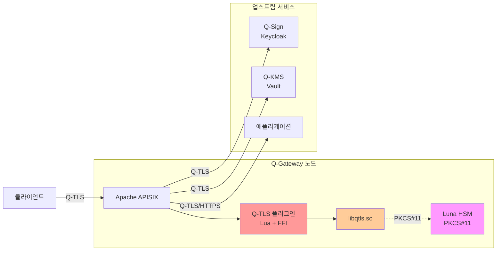

#### 설정 단계

**1. Q-TLS 라이브러리 설치**

```bash
# Q-TLS 빌드 및 설치
cd /home/user/QSIGN/Q-TLS
mkdir build && cd build
cmake .. -DCMAKE_BUILD_TYPE=Release -DENABLE_HSM=ON
make -j$(nproc)
sudo make install
sudo ldconfig
```

**2. APISIX Q-TLS 플러그인 설치**

```bash
# 플러그인 복사
sudo cp /home/user/QSIGN/Q-TLS/adapters/apisix/qtls-plugin.lua \
    /usr/local/apisix/apisix/plugins/qtls.lua

sudo cp /home/user/QSIGN/Q-TLS/adapters/apisix/schema.lua \
    /usr/local/apisix/apisix/plugins/qtls/schema.lua
```

**3. APISIX 구성**

`/usr/local/apisix/conf/config.yaml`:

```yaml
# APISIX 구성
apisix:
  node_listen: 9080                # HTTP 포트 (관리용)
  ssl:
    listen_port: 9443              # HTTPS 포트
    ssl_protocols: "TLSv1.3"
    ssl_ciphers: "ECDHE-ECDSA-AES256-GCM-SHA384:ECDHE-RSA-AES256-GCM-SHA384"

# 플러그인 활성화
plugins:
  - limit-req
  - limit-count
  - limit-conn
  - prometheus
  - request-id
  - qtls                           # Q-TLS 플러그인 추가

# Q-TLS 플러그인 전역 설정
plugin_attr:
  qtls:
    hsm_pkcs11_lib: /usr/lib/libCryptoki2_64.so
    hsm_token_label: "qtls-gateway"
    hsm_pin: "gateway_hsm_pin"
    hybrid_mode: true
    fips_mode: true
    log_level: info
    session_timeout: 3600
    enable_metrics: true

# etcd 구성
deployment:
  role: traditional
  role_traditional:
    config_provider: etcd
  admin:
    admin_key:
      - name: "admin"
        key: edd1c9f034335f136f87ad84b625c8f1
        role: admin
    enable_admin_cors: true
    allow_admin:
      - 0.0.0.0/0
    admin_listen:
      ip: 0.0.0.0
      port: 9180

  etcd:
    host:
      - "http://127.0.0.1:2379"
    prefix: "/apisix"
    timeout: 30

# Prometheus 메트릭
plugin_attr:
  prometheus:
    export_addr:
      ip: 0.0.0.0
      port: 9091
```

**4. 라우트 구성**

```bash
# Q-Sign 인증 라우트
curl http://127.0.0.1:9180/apisix/admin/routes/auth \
  -H 'X-API-KEY: edd1c9f034335f136f87ad84b625c8f1' \
  -X PUT -d '
{
  "name": "qsign-auth",
  "uri": "/auth/*",
  "plugins": {
    "qtls": {
      "certificate": "/etc/qsign/certs/gateway-cert.pem",
      "hsm_key_uri": "pkcs11:token=qtls-gateway;object=gateway-key;type=private",
      "hybrid_mode": true,
      "require_qtls": true,
      "mutual_tls": false
    },
    "prometheus": {
      "prefer_name": true
    }
  },
  "upstream": {
    "type": "roundrobin",
    "scheme": "https",
    "nodes": {
      "auth.qsign.local:8443": 1
    },
    "keepalive_pool": {
      "size": 320,
      "idle_timeout": 60,
      "requests": 1000
    },
    "checks": {
      "active": {
        "type": "https",
        "timeout": 1,
        "http_path": "/health",
        "healthy": {
          "interval": 2,
          "successes": 2
        },
        "unhealthy": {
          "interval": 1,
          "http_failures": 2
        }
      }
    }
  }
}'

# Q-KMS API 라우트
curl http://127.0.0.1:9180/apisix/admin/routes/kms \
  -H 'X-API-KEY: edd1c9f034335f136f87ad84b625c8f1' \
  -X PUT -d '
{
  "name": "qkms-api",
  "uri": "/v1/qtls/*",
  "plugins": {
    "qtls": {
      "certificate": "/etc/qsign/certs/gateway-cert.pem",
      "hsm_key_uri": "pkcs11:token=qtls-gateway;object=gateway-key;type=private",
      "hybrid_mode": true,
      "require_qtls": true,
      "mutual_tls": true,
      "client_ca_cert": "/etc/qsign/certs/qsign-ca-bundle.pem",
      "verify_depth": 3
    },
    "limit-req": {
      "rate": 100,
      "burst": 50,
      "key": "remote_addr",
      "rejected_code": 429
    }
  },
  "upstream": {
    "type": "roundrobin",
    "scheme": "https",
    "nodes": {
      "vault.qsign.local:8200": 1
    }
  }
}'

# 애플리케이션 API 라우트
curl http://127.0.0.1:9180/apisix/admin/routes/api \
  -H 'X-API-KEY: edd1c9f034335f136f87ad84b625c8f1' \
  -X PUT -d '
{
  "name": "app-api",
  "uri": "/api/*",
  "plugins": {
    "qtls": {
      "certificate": "/etc/qsign/certs/gateway-cert.pem",
      "hsm_key_uri": "pkcs11:token=qtls-gateway;object=gateway-key;type=private",
      "hybrid_mode": true,
      "require_qtls": false,
      "mutual_tls": false
    },
    "jwt-auth": {
      "key": "qsign-jwt",
      "secret": "from-vault"
    }
  },
  "upstream": {
    "type": "roundrobin",
    "nodes": {
      "app1.qsign.local:8443": 1,
      "app2.qsign.local:8443": 1
    },
    "hash_on": "header",
    "key": "X-Session-ID"
  }
}'
```

### Q-Sign (Keycloak) 통합

Q-Sign은 QSIGN의 인증 및 권한 부여 서버입니다.

#### 아키텍처

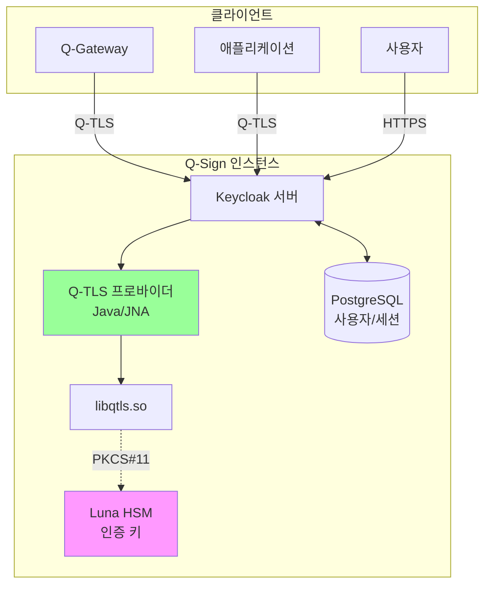

#### 설정 단계

**1. Keycloak Q-TLS 프로바이더 빌드**

```bash
cd /home/user/QSIGN/Q-TLS/adapters/keycloak
mvn clean package
sudo cp target/keycloak-qtls-provider-1.0.0.jar /opt/keycloak/providers/
```

**2. Keycloak 구성**

`/opt/keycloak/conf/keycloak.conf`:

```properties
# 데이터베이스 구성
db=postgres
db-url=jdbc:postgresql://localhost:5432/keycloak
db-username=keycloak
db-password=secure_password
db-pool-initial-size=5
db-pool-min-size=5
db-pool-max-size=20

# 호스트명 구성
hostname=auth.qsign.local
hostname-strict=true
hostname-strict-https=true

# HTTP/HTTPS 구성
http-enabled=false
https-port=8443

# Q-TLS 구성
spi-qtls-enabled=true
spi-qtls-certificate-path=/etc/qsign/certs/auth-cert.pem
spi-qtls-hsm-key-uri=pkcs11:token=qtls-auth;object=auth-key;type=private
spi-qtls-hsm-pkcs11-lib=/usr/lib/libCryptoki2_64.so
spi-qtls-ca-cert-path=/etc/qsign/certs/qsign-ca-bundle.pem
spi-qtls-hybrid-mode=true
spi-qtls-mutual-tls=true
spi-qtls-fips-mode=true
spi-qtls-verify-depth=3
spi-qtls-session-timeout=7200

# 클러스터링 (선택사항)
cache-stack=tcp
cache-config-file=cache-ispn-tcp.xml

# 로깅
log-level=INFO
log-console-format=%d{yyyy-MM-dd HH:mm:ss,SSS} %-5p [%c] (%t) %s%e%n

# 메트릭
metrics-enabled=true
```

**3. Realm 구성**

```bash
# Keycloak Admin CLI 사용
/opt/keycloak/bin/kcadm.sh config credentials \
  --server https://auth.qsign.local:8443 \
  --realm master \
  --user admin \
  --password admin_password

# QSIGN Realm 생성
/opt/keycloak/bin/kcadm.sh create realms \
  -s realm=qsign \
  -s enabled=true \
  -s sslRequired=all \
  -s registrationAllowed=false \
  -s resetPasswordAllowed=true \
  -s rememberMe=true \
  -s loginWithEmailAllowed=true \
  -s duplicateEmailsAllowed=false

# Q-TLS 클라이언트 인증 활성화
/opt/keycloak/bin/kcadm.sh update authentication/flows/browser/executions \
  -r qsign \
  -s requirement=REQUIRED \
  -s providerId=auth-x509-client-username-form

# OIDC 클라이언트 생성 (Q-Gateway용)
/opt/keycloak/bin/kcadm.sh create clients -r qsign \
  -s clientId=q-gateway \
  -s enabled=true \
  -s protocol=openid-connect \
  -s publicClient=false \
  -s directAccessGrantsEnabled=true \
  -s serviceAccountsEnabled=true \
  -s 'redirectUris=["https://gateway.qsign.local/*"]' \
  -s 'webOrigins=["https://gateway.qsign.local"]' \
  -s attributes='{"qtls.enabled":"true","qtls.require.mutual.auth":"true"}'
```

**4. 사용자 및 역할 구성**

```bash
# 관리자 그룹 생성
/opt/keycloak/bin/kcadm.sh create groups -r qsign -s name=qsign-admins

# 역할 생성
/opt/keycloak/bin/kcadm.sh create roles -r qsign -s name=admin -s description='QSIGN 관리자'
/opt/keycloak/bin/kcadm.sh create roles -r qsign -s name=user -s description='QSIGN 사용자'
/opt/keycloak/bin/kcadm.sh create roles -r qsign -s name=api-access -s description='API 접근'

# 사용자 생성
/opt/keycloak/bin/kcadm.sh create users -r qsign \
  -s username=admin@qsign.local \
  -s enabled=true \
  -s emailVerified=true \
  -s email=admin@qsign.local \
  -s firstName=QSIGN \
  -s lastName=Administrator

# 비밀번호 설정
/opt/keycloak/bin/kcadm.sh set-password -r qsign \
  --username admin@qsign.local \
  --new-password AdminPassword123!
```

### Q-KMS (Vault) 통합

Q-KMS는 QSIGN의 키 및 시크릿 관리 시스템입니다.

#### 아키텍처

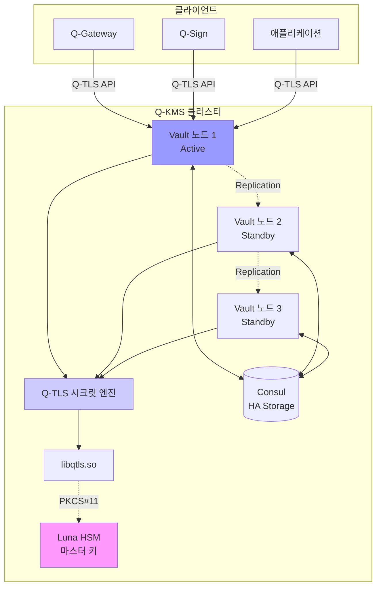

#### 설정 단계

**1. Vault Q-TLS 플러그인 빌드**

```bash
cd /home/user/QSIGN/Q-TLS/adapters/vault
go mod download
go build -o vault-plugin-secrets-qtls main.go

# 체크섬 계산
sha256sum vault-plugin-secrets-qtls > SHA256SUMS

# 플러그인 복사
sudo mkdir -p /etc/vault/plugins
sudo cp vault-plugin-secrets-qtls /etc/vault/plugins/
sudo chmod +x /etc/vault/plugins/vault-plugin-secrets-qtls
```

**2. Vault 서버 구성**

`/etc/vault/config.hcl`:

```hcl
# Vault 서버 구성
ui = true
disable_mlock = false

# 스토리지 백엔드 (Consul)
storage "consul" {
  address = "127.0.0.1:8500"
  path    = "vault/"
  scheme  = "https"
  tls_ca_file   = "/etc/qsign/certs/qsign-root-ca.pem"
  tls_cert_file = "/etc/qsign/certs/vault-cert.pem"
  tls_key_file  = "pkcs11:token=qtls-vault;object=vault-key"
}

# HTTPS 리스너
listener "tcp" {
  address       = "0.0.0.0:8200"
  tls_disable   = false
  tls_cert_file = "/etc/qsign/certs/vault-cert.pem"
  tls_key_file  = "pkcs11:token=qtls-vault;object=vault-key"
  tls_min_version = "tls13"
  tls_cipher_suites = "TLS_AES_256_GCM_SHA384,TLS_CHACHA20_POLY1305_SHA256"
  tls_require_and_verify_client_cert = true
  tls_client_ca_file = "/etc/qsign/certs/qsign-ca-bundle.pem"
}

# 클러스터 리스너
listener "tcp" {
  address       = "0.0.0.0:8201"
  tls_disable   = false
  tls_cert_file = "/etc/qsign/certs/vault-cert.pem"
  tls_key_file  = "pkcs11:token=qtls-vault;object=vault-key"
}

# 플러그인 디렉토리
plugin_directory = "/etc/vault/plugins"

# API 주소
api_addr = "https://vault.qsign.local:8200"
cluster_addr = "https://vault1.qsign.local:8201"

# 텔레메트리
telemetry {
  prometheus_retention_time = "30s"
  disable_hostname = false
}

# HSM 봉인 (Luna HSM)
seal "pkcs11" {
  lib            = "/usr/lib/libCryptoki2_64.so"
  slot           = "0"
  pin            = "vault_hsm_pin"
  key_label      = "vault-master-key"
  hmac_key_label = "vault-hmac-key"
  generate_key   = "true"
}
```

**3. Vault 초기화 및 Q-TLS 플러그인 등록**

```bash
# Vault 시작
sudo systemctl start vault

# 환경 변수 설정
export VAULT_ADDR='https://vault.qsign.local:8200'
export VAULT_CACERT='/etc/qsign/certs/qsign-root-ca.pem'
export VAULT_CLIENT_CERT='/etc/qsign/certs/admin-cert.pem'
export VAULT_CLIENT_KEY='/etc/qsign/certs/admin-key.pem'

# Vault 초기화 (HSM 봉인 사용)
vault operator init -recovery-shares=5 -recovery-threshold=3

# 복구 키 안전하게 저장
# (출력된 복구 키를 안전한 장소에 저장)

# 플러그인 등록
PLUGIN_SHA=$(sha256sum /etc/vault/plugins/vault-plugin-secrets-qtls | cut -d' ' -f1)
vault plugin register \
  -sha256=$PLUGIN_SHA \
  -command=vault-plugin-secrets-qtls \
  secret \
  qtls-secrets

# Q-TLS 시크릿 엔진 활성화
vault secrets enable \
  -path=qtls \
  -plugin-name=qtls-secrets \
  plugin

# HSM 구성
vault write qtls/config/hsm \
  pkcs11_lib="/usr/lib/libCryptoki2_64.so" \
  token_label="qtls-vault" \
  pin="vault_hsm_pin"

# 정책 생성
vault policy write qtls-admin - <<EOF
# Q-TLS 관리자 정책
path "qtls/*" {
  capabilities = ["create", "read", "update", "delete", "list"]
}

path "qtls/keys/*" {
  capabilities = ["create", "read", "update", "delete", "list"]
}

path "qtls/encapsulate/*" {
  capabilities = ["create", "update"]
}

path "qtls/decapsulate/*" {
  capabilities = ["create", "update"]
}

path "qtls/sign/*" {
  capabilities = ["create", "update"]
}

path "qtls/verify/*" {
  capabilities = ["create", "update"]
}
EOF

# API용 정책
vault policy write qtls-api - <<EOF
# Q-TLS API 정책
path "qtls/keys/*" {
  capabilities = ["read", "list"]
}

path "qtls/encapsulate/*" {
  capabilities = ["create", "update"]
}

path "qtls/verify/*" {
  capabilities = ["create", "update"]
}
EOF
```

**4. 인증 구성**

```bash
# 인증서 기반 인증 활성화
vault auth enable cert

# Q-Gateway 인증서 구성
vault write auth/cert/certs/q-gateway \
  display_name=q-gateway \
  policies=qtls-admin \
  certificate=@/etc/qsign/certs/gateway-cert.pem \
  ttl=3600

# Q-Sign 인증서 구성
vault write auth/cert/certs/q-sign \
  display_name=q-sign \
  policies=qtls-admin \
  certificate=@/etc/qsign/certs/auth-cert.pem \
  ttl=3600

# 애플리케이션 인증서 구성
vault write auth/cert/certs/applications \
  display_name=applications \
  policies=qtls-api \
  certificate=@/etc/qsign/certs/app-ca-cert.pem \
  ttl=1800
```

---

## 단계별 배포 가이드

### 사전 요구사항

#### 하드웨어 요구사항

| 컴포넌트 | CPU | 메모리 | 스토리지 | 네트워크 |
|---------|-----|--------|---------|---------|
| Q-Gateway | 4 코어 | 8 GB | 50 GB SSD | 1 Gbps |
| Q-Sign | 4 코어 | 16 GB | 100 GB SSD | 1 Gbps |
| Q-KMS | 4 코어 | 8 GB | 100 GB SSD | 1 Gbps |
| Luna HSM | - | - | - | 1 Gbps |
| PostgreSQL | 4 코어 | 16 GB | 200 GB SSD | 1 Gbps |
| Consul | 2 코어 | 4 GB | 50 GB SSD | 1 Gbps |

#### 소프트웨어 요구사항

```bash
# 운영 체제
Ubuntu 22.04 LTS 또는 RHEL 8.x

# 필수 패키지
sudo apt-get update
sudo apt-get install -y \
    build-essential \
    cmake \
    git \
    libssl-dev \
    postgresql-client \
    openjdk-17-jdk \
    maven \
    golang-1.21 \
    lua5.1 \
    luarocks \
    doxygen \
    astyle

# liboqs 설치 (PQC 라이브러리)
git clone https://github.com/open-quantum-safe/liboqs.git
cd liboqs
mkdir build && cd build
cmake -DCMAKE_INSTALL_PREFIX=/usr/local \
      -DOQS_USE_OPENSSL=ON \
      -DBUILD_SHARED_LIBS=ON ..
make -j$(nproc)
sudo make install
sudo ldconfig
```

### 1단계: Luna HSM 설정

```bash
# Luna HSM 클라이언트 설치
sudo dpkg -i LunaClient-10.x.x.deb

# HSM 네트워크 구성
/usr/safenet/lunaclient/bin/vtl addServer \
    -n hsm.qsign.local \
    -i 192.168.1.100

# 인증서 등록
/usr/safenet/lunaclient/bin/vtl createCert \
    -n hsm.qsign.local

# 파티션 등록
/usr/safenet/lunaclient/bin/vtl assignPartition -n qsign-partition

# 연결 테스트
/usr/safenet/lunaclient/bin/vtl verify

# PKCS#11 라이브러리 확인
ls -l /usr/lib/libCryptoki2_64.so
```

### 2단계: QSIGN PKI 구축

```bash
# PKI 디렉토리 생성
sudo mkdir -p /etc/qsign/ca/{root,intermediate,certs,crl,newcerts}
sudo mkdir -p /etc/qsign/ca/private
sudo chmod 700 /etc/qsign/ca/private

# Root CA 구성
cd /etc/qsign/ca

# openssl.cnf 생성 (하이브리드 확장 포함)
sudo tee openssl-root.cnf > /dev/null <<'EOF'
[ ca ]
default_ca = CA_default

[ CA_default ]
dir               = /etc/qsign/ca/root
certs             = $dir/certs
crl_dir           = $dir/crl
new_certs_dir     = $dir/newcerts
database          = $dir/index.txt
serial            = $dir/serial
RANDFILE          = $dir/private/.rand

private_key       = $dir/private/root-ca.key
certificate       = $dir/certs/root-ca.crt

crlnumber         = $dir/crlnumber
crl               = $dir/crl/root-ca.crl
crl_extensions    = crl_ext
default_crl_days  = 30

default_md        = sha384
name_opt          = ca_default
cert_opt          = ca_default
default_days      = 7300
preserve          = no
policy            = policy_strict

[ policy_strict ]
countryName             = match
stateOrProvinceName     = optional
organizationName        = match
organizationalUnitName  = optional
commonName              = supplied
emailAddress            = optional

[ req ]
default_bits        = 4096
distinguished_name  = req_distinguished_name
string_mask         = utf8only
default_md          = sha384
x509_extensions     = v3_ca

[ req_distinguished_name ]
countryName                     = Country Name (2 letter code)
stateOrProvinceName             = State or Province Name
localityName                    = Locality Name
0.organizationName              = Organization Name
organizationalUnitName          = Organizational Unit Name
commonName                      = Common Name
emailAddress                    = Email Address

countryName_default             = KR
stateOrProvinceName_default     = Seoul
0.organizationName_default      = QSIGN
organizationalUnitName_default  = QSIGN PKI
emailAddress_default            = ca@qsign.local

[ v3_ca ]
subjectKeyIdentifier = hash
authorityKeyIdentifier = keyid:always,issuer
basicConstraints = critical, CA:true
keyUsage = critical, digitalSignature, cRLSign, keyCertSign

[ v3_intermediate_ca ]
subjectKeyIdentifier = hash
authorityKeyIdentifier = keyid:always,issuer
basicConstraints = critical, CA:true, pathlen:0
keyUsage = critical, digitalSignature, cRLSign, keyCertSign
crlDistributionPoints = @crl_info
authorityInfoAccess = @ocsp_info

[ crl_info ]
URI.0 = http://crl.qsign.local/qsign-root-ca.crl

[ ocsp_info ]
OCSP;URI.0 = http://ocsp.qsign.local
caIssuers;URI.0 = http://ca.qsign.local/qsign-root-ca.crt
EOF

# Root CA 개인키 생성 (HSM에서)
/usr/safenet/lunaclient/bin/cmu generatekeypair \
    -keyType=RSA \
    -modulusBits=4096 \
    -publicExponent=65537 \
    -sign=T \
    -verify=T \
    -labelpublic=qsign-root-ca-pub \
    -labelprivate=qsign-root-ca-priv

# Root CA 인증서 생성
sudo openssl req -config openssl-root.cnf \
    -key "pkcs11:token=qsign-partition;object=qsign-root-ca-priv;type=private" \
    -new -x509 -days 7300 -sha384 -extensions v3_ca \
    -out root/certs/root-ca.crt \
    -subj "/C=KR/ST=Seoul/O=QSIGN/OU=QSIGN PKI/CN=QSIGN Root CA"

# Intermediate CA 생성 (TLS용)
/usr/safenet/lunaclient/bin/cmu generatekeypair \
    -keyType=RSA \
    -modulusBits=4096 \
    -publicExponent=65537 \
    -sign=T \
    -verify=T \
    -labelpublic=qsign-tls-ca-pub \
    -labelprivate=qsign-tls-ca-priv

# Intermediate CA CSR 생성
sudo openssl req -config openssl-root.cnf \
    -new -sha384 \
    -key "pkcs11:token=qsign-partition;object=qsign-tls-ca-priv;type=private" \
    -out intermediate/csr/tls-ca.csr \
    -subj "/C=KR/ST=Seoul/O=QSIGN/OU=QSIGN PKI/CN=QSIGN TLS CA"

# Intermediate CA 서명
sudo openssl ca -config openssl-root.cnf \
    -extensions v3_intermediate_ca \
    -days 3650 -notext -md sha384 \
    -in intermediate/csr/tls-ca.csr \
    -out intermediate/certs/tls-ca.crt

# 인증서 체인 생성
cat intermediate/certs/tls-ca.crt root/certs/root-ca.crt \
    > intermediate/certs/tls-ca-chain.crt

# 검증
openssl verify -CAfile root/certs/root-ca.crt \
    intermediate/certs/tls-ca.crt
```

### 3단계: 컴포넌트 인증서 발급

```bash
# Q-Gateway 인증서 발급 스크립트
sudo tee /etc/qsign/ca/issue-cert.sh > /dev/null <<'EOF'
#!/bin/bash
set -e

COMPONENT=$1
HOSTNAME=$2
SAN=$3

if [ -z "$COMPONENT" ] || [ -z "$HOSTNAME" ]; then
    echo "Usage: $0 <component> <hostname> [SAN]"
    echo "Example: $0 gateway gateway.qsign.local '*.gateway.qsign.local'"
    exit 1
fi

# HSM에서 키 생성
/usr/safenet/lunaclient/bin/cmu generatekeypair \
    -keyType=RSA \
    -modulusBits=4096 \
    -publicExponent=65537 \
    -sign=T \
    -derive=T \
    -labelpublic="${COMPONENT}-pub" \
    -labelprivate="${COMPONENT}-priv"

# CSR 생성
cat > /tmp/${COMPONENT}.cnf <<EOC
[req]
default_bits = 4096
distinguished_name = req_distinguished_name
req_extensions = v3_req
prompt = no

[req_distinguished_name]
C = KR
ST = Seoul
O = QSIGN
OU = QSIGN Infrastructure
CN = ${HOSTNAME}

[v3_req]
keyUsage = keyEncipherment, dataEncipherment, digitalSignature
extendedKeyUsage = serverAuth, clientAuth
subjectAltName = @alt_names

[alt_names]
DNS.1 = ${HOSTNAME}
$(if [ -n "$SAN" ]; then echo "DNS.2 = $SAN"; fi)
EOC

openssl req -config /tmp/${COMPONENT}.cnf \
    -new -sha384 \
    -key "pkcs11:token=qsign-partition;object=${COMPONENT}-priv;type=private" \
    -out /etc/qsign/ca/certs/${COMPONENT}.csr

# 인증서 서명
openssl ca -config /etc/qsign/ca/openssl-root.cnf \
    -extensions server_cert \
    -days 365 -notext -md sha384 \
    -in /etc/qsign/ca/certs/${COMPONENT}.csr \
    -out /etc/qsign/ca/certs/${COMPONENT}.crt

# 인증서 체인 생성
cat /etc/qsign/ca/certs/${COMPONENT}.crt \
    /etc/qsign/ca/intermediate/certs/tls-ca-chain.crt \
    > /etc/qsign/ca/certs/${COMPONENT}-chain.crt

echo "Certificate issued for ${COMPONENT} (${HOSTNAME})"
rm /tmp/${COMPONENT}.cnf
EOF

sudo chmod +x /etc/qsign/ca/issue-cert.sh

# 컴포넌트 인증서 발급
sudo /etc/qsign/ca/issue-cert.sh gateway gateway.qsign.local "*.gateway.qsign.local"
sudo /etc/qsign/ca/issue-cert.sh auth auth.qsign.local
sudo /etc/qsign/ca/issue-cert.sh vault vault.qsign.local
```

### 4단계: Q-TLS 라이브러리 배포

```bash
# Q-TLS 빌드
cd /home/user/QSIGN/Q-TLS
mkdir -p build && cd build

cmake .. \
    -DCMAKE_BUILD_TYPE=Release \
    -DENABLE_HSM=ON \
    -DENABLE_TESTS=ON \
    -DFIPS_MODE=ON \
    -DCMAKE_INSTALL_PREFIX=/usr/local

make -j$(nproc)
sudo make install
sudo ldconfig

# 설치 확인
ldconfig -p | grep libqtls
pkg-config --modversion qtls
```

### 5단계: 컴포넌트 배포

#### PostgreSQL 설치 및 구성

```bash
# PostgreSQL 설치
sudo apt-get install -y postgresql-14 postgresql-contrib

# Keycloak 데이터베이스 생성
sudo -u postgres psql <<EOF
CREATE DATABASE keycloak;
CREATE USER keycloak WITH ENCRYPTED PASSWORD 'secure_password';
GRANT ALL PRIVILEGES ON DATABASE keycloak TO keycloak;
\c keycloak
GRANT ALL ON SCHEMA public TO keycloak;
EOF

# SSL 활성화
sudo -u postgres psql -c "ALTER SYSTEM SET ssl = on;"
sudo cp /etc/qsign/ca/certs/postgres.crt /var/lib/postgresql/14/main/server.crt
sudo cp /etc/qsign/ca/certs/postgres.key /var/lib/postgresql/14/main/server.key
sudo chown postgres:postgres /var/lib/postgresql/14/main/server.*
sudo chmod 600 /var/lib/postgresql/14/main/server.key

# PostgreSQL 재시작
sudo systemctl restart postgresql
```

#### Consul 설치 및 구성

```bash
# Consul 설치
wget https://releases.hashicorp.com/consul/1.17.0/consul_1.17.0_linux_amd64.zip
unzip consul_1.17.0_linux_amd64.zip
sudo mv consul /usr/local/bin/
sudo chmod +x /usr/local/bin/consul

# Consul 구성
sudo mkdir -p /etc/consul.d
sudo tee /etc/consul.d/consul.hcl > /dev/null <<EOF
datacenter = "qsign-dc1"
data_dir = "/opt/consul/data"
log_level = "INFO"

server = true
bootstrap_expect = 1

bind_addr = "0.0.0.0"
client_addr = "0.0.0.0"

ui_config {
  enabled = true
}

encrypt = "$(consul keygen)"

tls {
  defaults {
    ca_file = "/etc/qsign/certs/qsign-root-ca.pem"
    cert_file = "/etc/qsign/certs/consul-cert.pem"
    key_file = "pkcs11:token=qsign-partition;object=consul-priv"
    verify_incoming = true
    verify_outgoing = true
  }
}
EOF

# Consul 서비스 생성
sudo tee /etc/systemd/system/consul.service > /dev/null <<EOF
[Unit]
Description=Consul Service
After=network.target

[Service]
Type=simple
User=consul
Group=consul
ExecStart=/usr/local/bin/consul agent -config-dir=/etc/consul.d
ExecReload=/bin/kill -HUP \$MAINPID
KillSignal=SIGTERM
Restart=on-failure
RestartSec=5

[Install]
WantedBy=multi-user.target
EOF

# Consul 시작
sudo useradd -r -s /bin/false consul
sudo mkdir -p /opt/consul/data
sudo chown -R consul:consul /opt/consul
sudo systemctl enable consul
sudo systemctl start consul
```

#### Q-Gateway 배포

```bash
# Apache APISIX 설치
wget https://downloads.apache.org/apisix/2.15.0/apache-apisix-2.15.0-src.tgz
tar xzf apache-apisix-2.15.0-src.tgz
cd apache-apisix-2.15.0

# 의존성 설치
sudo luarocks install apisix-2.15.0-0.rockspec

# Q-TLS 플러그인 복사
sudo cp /home/user/QSIGN/Q-TLS/adapters/apisix/qtls-plugin.lua \
    /usr/local/apisix/apisix/plugins/qtls.lua

# 구성 파일 복사 (이전에 생성한 config.yaml)
sudo cp config.yaml /usr/local/apisix/conf/

# 인증서 복사
sudo mkdir -p /etc/apisix/ssl
sudo cp /etc/qsign/ca/certs/gateway-chain.crt /etc/apisix/ssl/
sudo cp /etc/qsign/ca/certs/qsign-ca-bundle.pem /etc/apisix/ssl/

# APISIX 시작
sudo apisix start

# 상태 확인
curl http://127.0.0.1:9180/apisix/admin/plugins/qtls \
    -H 'X-API-KEY: edd1c9f034335f136f87ad84b625c8f1'
```

#### Q-Sign 배포

```bash
# Keycloak 다운로드
wget https://github.com/keycloak/keycloak/releases/download/23.0.0/keycloak-23.0.0.tar.gz
tar xzf keycloak-23.0.0.tar.gz
sudo mv keycloak-23.0.0 /opt/keycloak

# Q-TLS 프로바이더 복사
sudo cp /home/user/QSIGN/Q-TLS/adapters/keycloak/target/keycloak-qtls-provider-1.0.0.jar \
    /opt/keycloak/providers/

# 구성 파일 복사
sudo cp keycloak.conf /opt/keycloak/conf/

# 인증서 복사
sudo mkdir -p /opt/keycloak/conf/certs
sudo cp /etc/qsign/ca/certs/auth-chain.crt /opt/keycloak/conf/certs/
sudo cp /etc/qsign/ca/certs/qsign-ca-bundle.pem /opt/keycloak/conf/certs/

# Keycloak 빌드
cd /opt/keycloak
bin/kc.sh build

# 관리자 사용자 생성
export KEYCLOAK_ADMIN=admin
export KEYCLOAK_ADMIN_PASSWORD=admin_password

# Keycloak 시작
bin/kc.sh start --optimized
```

#### Q-KMS 배포

```bash
# HashiCorp Vault 설치
wget https://releases.hashicorp.com/vault/1.15.0/vault_1.15.0_linux_amd64.zip
unzip vault_1.15.0_linux_amd64.zip
sudo mv vault /usr/local/bin/
sudo chmod +x /usr/local/bin/vault

# Q-TLS 플러그인 복사
sudo mkdir -p /etc/vault/plugins
sudo cp /home/user/QSIGN/Q-TLS/adapters/vault/vault-plugin-secrets-qtls \
    /etc/vault/plugins/

# 구성 파일 복사
sudo mkdir -p /etc/vault
sudo cp config.hcl /etc/vault/

# 인증서 복사
sudo mkdir -p /etc/vault/tls
sudo cp /etc/qsign/ca/certs/vault-chain.crt /etc/vault/tls/
sudo cp /etc/qsign/ca/certs/qsign-ca-bundle.pem /etc/vault/tls/

# Vault 서비스 생성
sudo tee /etc/systemd/system/vault.service > /dev/null <<EOF
[Unit]
Description=HashiCorp Vault
After=network.target

[Service]
Type=notify
User=vault
Group=vault
ExecStart=/usr/local/bin/vault server -config=/etc/vault/config.hcl
ExecReload=/bin/kill -HUP \$MAINPID
KillSignal=SIGTERM
Restart=on-failure
RestartSec=5
LimitNOFILE=65536

[Install]
WantedBy=multi-user.target
EOF

# Vault 시작
sudo useradd -r -s /bin/false vault
sudo chown -R vault:vault /etc/vault
sudo systemctl enable vault
sudo systemctl start vault
```

### 6단계: 통합 테스트

```bash
# Q-Gateway 연결 테스트
curl --cacert /etc/qsign/ca/root/certs/root-ca.crt \
    https://gateway.qsign.local:9443/apisix/status

# Q-Sign 연결 테스트
curl --cacert /etc/qsign/ca/root/certs/root-ca.crt \
    https://auth.qsign.local:8443/realms/qsign/.well-known/openid-configuration

# Q-KMS 연결 테스트
export VAULT_ADDR='https://vault.qsign.local:8200'
export VAULT_CACERT='/etc/qsign/ca/root/certs/root-ca.crt'
vault status

# 엔드투엔드 테스트
# 1. 토큰 획득
TOKEN=$(curl --cacert /etc/qsign/ca/root/certs/root-ca.crt \
    -X POST https://gateway.qsign.local:9443/auth/realms/qsign/protocol/openid-connect/token \
    -d "client_id=q-gateway" \
    -d "client_secret=<secret>" \
    -d "grant_type=client_credentials" | jq -r '.access_token')

# 2. API 호출
curl --cacert /etc/qsign/ca/root/certs/root-ca.crt \
    -H "Authorization: Bearer $TOKEN" \
    https://gateway.qsign.local:9443/api/test
```

---

## 인증서 체인 설정

### 인증서 검증 체인

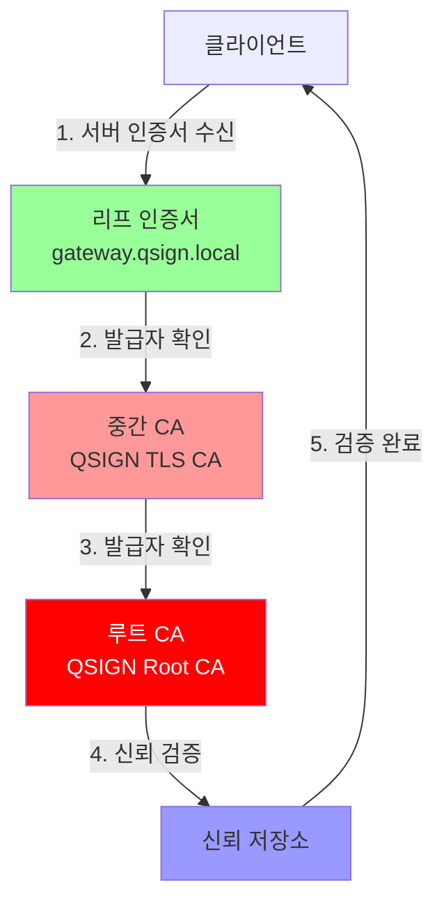

### 인증서 배포

```bash
# 시스템 신뢰 저장소에 루트 CA 추가
sudo cp /etc/qsign/ca/root/certs/root-ca.crt \
    /usr/local/share/ca-certificates/qsign-root-ca.crt
sudo update-ca-certificates

# Java 키스토어에 추가 (Keycloak용)
sudo keytool -import \
    -trustcacerts \
    -alias qsign-root-ca \
    -file /etc/qsign/ca/root/certs/root-ca.crt \
    -keystore /opt/keycloak/lib/security/cacerts \
    -storepass changeit \
    -noprompt

# 애플리케이션별 번들 생성
cat /etc/qsign/ca/root/certs/root-ca.crt \
    /etc/qsign/ca/intermediate/certs/tls-ca.crt \
    > /etc/qsign/ca/certs/qsign-ca-bundle.pem
```

### OCSP 및 CRL 설정

```bash
# OCSP 응답자 설정
sudo tee /etc/qsign/ocsp/ocsp-responder.sh > /dev/null <<'EOF'
#!/bin/bash
openssl ocsp \
    -port 8888 \
    -text \
    -CA /etc/qsign/ca/intermediate/certs/tls-ca-chain.crt \
    -index /etc/qsign/ca/intermediate/index.txt \
    -rkey "pkcs11:token=qsign-partition;object=ocsp-responder-priv" \
    -rsigner /etc/qsign/ca/certs/ocsp-responder.crt \
    -nrequest 1
EOF

sudo chmod +x /etc/qsign/ocsp/ocsp-responder.sh

# CRL 생성 스크립트
sudo tee /etc/qsign/ca/generate-crl.sh > /dev/null <<'EOF'
#!/bin/bash
openssl ca -config /etc/qsign/ca/openssl-root.cnf \
    -gencrl \
    -out /etc/qsign/ca/crl/qsign-tls-ca.crl

# CRL을 웹 서버에 복사
sudo cp /etc/qsign/ca/crl/qsign-tls-ca.crl /var/www/html/crl/
EOF

sudo chmod +x /etc/qsign/ca/generate-crl.sh

# 주기적 CRL 업데이트 (cron)
echo "0 0 * * * /etc/qsign/ca/generate-crl.sh" | sudo crontab -
```

---

## HSM 키 관리

### Luna HSM 아키텍처

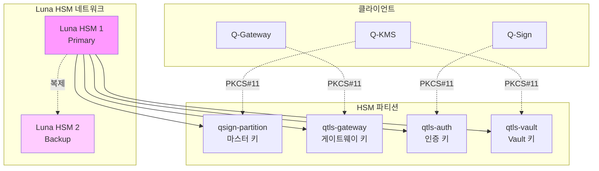

### HSM 키 관리 정책

#### 키 생명주기

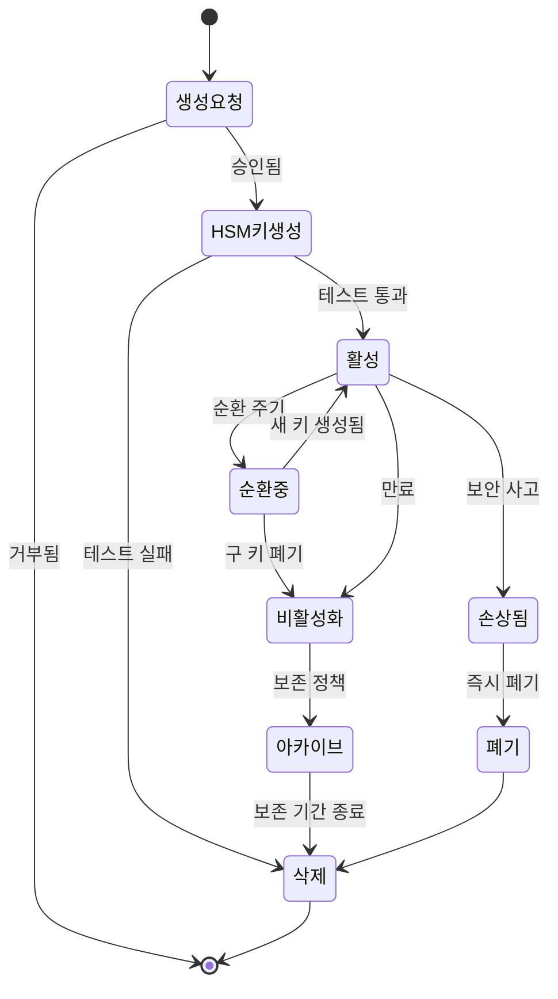

#### 키 유형별 관리

| 키 유형 | 알고리즘 | 크기 | 순환 주기 | 백업 | 사용 목적 |
|--------|---------|------|----------|------|----------|
| Root CA Key | RSA + DILITHIUM3 | 4096 + 4000 | 20년 | 오프라인 | 루트 CA 서명 |
| Intermediate CA Key | RSA + DILITHIUM3 | 4096 + 4000 | 10년 | HSM 복제 | 중간 CA 서명 |
| TLS Server Key | RSA + DILITHIUM3 | 4096 + 4000 | 1년 | HSM 복제 | TLS 서버 인증 |
| Ephemeral KYBER Key | KYBER1024 | 3168 | 세션별 | 없음 | 키 교환 |
| Signing Key | DILITHIUM3 | 4000 | 2년 | HSM 복제 | 디지털 서명 |
| Vault Master Key | AES | 256 | 5년 | HSM 복제 | Vault 봉인 |

### HSM 운영 절차

#### 키 생성

```bash
# 1. 마스터 키 생성 (Vault용)
/usr/safenet/lunaclient/bin/cmu generatekey \
    -keyType=AES \
    -keySize=256 \
    -label=vault-master-key \
    -encrypt=T \
    -decrypt=T \
    -sign=T \
    -verify=T \
    -wrap=T \
    -unwrap=T \
    -derive=T \
    -extractable=F \
    -modifiable=F \
    -token

# 2. 서명 키쌍 생성 (DILITHIUM3 + RSA)
# RSA 키쌍
/usr/safenet/lunaclient/bin/cmu generatekeypair \
    -keyType=RSA \
    -modulusBits=4096 \
    -publicExponent=65537 \
    -sign=T \
    -verify=T \
    -labelpublic=component-rsa-pub \
    -labelprivate=component-rsa-priv \
    -extractable=F \
    -modifiable=F \
    -token

# DILITHIUM3 키쌍 (Q-TLS API 사용)
qtls-keygen \
    --hsm-token=qsign-partition \
    --algorithm=dilithium3 \
    --label=component-dilithium3 \
    --extractable=false

# 3. 임시 키 생성 (KYBER1024)
qtls-keygen \
    --hsm-token=qsign-partition \
    --algorithm=kyber1024 \
    --label=ephemeral-kyber \
    --session-only
```

#### 키 백업 및 복구

```bash
# Luna HSM 파티션 복제 설정
# Primary HSM에서
/usr/safenet/lunaclient/bin/vtl haAdmin -partition qsign-partition -enable

# Backup HSM에서
/usr/safenet/lunaclient/bin/vtl haAdmin -partition qsign-partition-backup -enable

# HA 그룹 생성
/usr/safenet/lunaclient/bin/vtl haAdmin \
    -group create \
    -label qsign-ha-group \
    -serialNum <primary-hsm-serial> \
    -partition qsign-partition

# Backup HSM을 HA 그룹에 추가
/usr/safenet/lunaclient/bin/vtl haAdmin \
    -group addMember \
    -group qsign-ha-group \
    -serialNum <backup-hsm-serial> \
    -partition qsign-partition-backup

# 동기화 확인
/usr/safenet/lunaclient/bin/vtl haAdmin -group synchronize -group qsign-ha-group
```

#### 키 순환

```bash
# 키 순환 스크립트
sudo tee /etc/qsign/scripts/rotate-keys.sh > /dev/null <<'EOF'
#!/bin/bash
set -e

COMPONENT=$1
OLD_LABEL=$2
NEW_LABEL=$3

if [ -z "$COMPONENT" ] || [ -z "$OLD_LABEL" ] || [ -z "$NEW_LABEL" ]; then
    echo "Usage: $0 <component> <old-label> <new-label>"
    exit 1
fi

echo "=== 키 순환 시작: $COMPONENT ==="

# 1. 새 키쌍 생성
echo "1. 새 키쌍 생성 중..."
/usr/safenet/lunaclient/bin/cmu generatekeypair \
    -keyType=RSA \
    -modulusBits=4096 \
    -publicExponent=65537 \
    -sign=T \
    -verify=T \
    -labelpublic="${NEW_LABEL}-rsa-pub" \
    -labelprivate="${NEW_LABEL}-rsa-priv" \
    -extractable=F \
    -token

qtls-keygen \
    --hsm-token=qsign-partition \
    --algorithm=dilithium3 \
    --label="${NEW_LABEL}-dilithium3" \
    --extractable=false

# 2. 새 인증서 발급
echo "2. 새 인증서 발급 중..."
/etc/qsign/ca/issue-cert.sh $COMPONENT $COMPONENT.qsign.local

# 3. 설정 업데이트 (예: APISIX)
echo "3. 설정 업데이트 중..."
# 컴포넌트에 따라 구성 업데이트

# 4. 서비스 재시작
echo "4. 서비스 재시작 중..."
sudo systemctl reload $COMPONENT

# 5. 검증
echo "5. 새 키 검증 중..."
sleep 5
curl --cacert /etc/qsign/ca/root/certs/root-ca.crt \
    https://$COMPONENT.qsign.local/health

# 6. 구 키 비활성화 (즉시 삭제하지 않음)
echo "6. 구 키 비활성화 중..."
/usr/safenet/lunaclient/bin/cmu setAttribute \
    -label="${OLD_LABEL}-rsa-priv" \
    -extractable=F \
    -modifiable=F \
    -private=T \
    -token

echo "=== 키 순환 완료 ==="
echo "구 키는 30일 후 삭제됩니다."
echo "삭제 명령: cmu delete -label=${OLD_LABEL}"
EOF

sudo chmod +x /etc/qsign/scripts/rotate-keys.sh

# 실행 예시
sudo /etc/qsign/scripts/rotate-keys.sh gateway gateway-key-2024 gateway-key-2025
```

#### HSM 모니터링

```bash
# HSM 상태 모니터링 스크립트
sudo tee /etc/qsign/scripts/hsm-monitor.sh > /dev/null <<'EOF'
#!/bin/bash

# HSM 연결 확인
/usr/safenet/lunaclient/bin/vtl verify > /tmp/hsm-status.txt 2>&1

if [ $? -ne 0 ]; then
    echo "ERROR: HSM 연결 실패"
    cat /tmp/hsm-status.txt
    # 알림 전송 (예: Slack, Email)
    exit 1
fi

# HSM 파티션 상태 확인
/usr/safenet/lunaclient/bin/lunacm << EOC
partition showInfo -partition qsign-partition
EOC

# 키 개수 확인
KEY_COUNT=$(/usr/safenet/lunaclient/bin/cmu list | grep -c "Private Key")
echo "HSM에 저장된 개인키 개수: $KEY_COUNT"

# HA 상태 확인
/usr/safenet/lunaclient/bin/vtl haAdmin -group show -group qsign-ha-group

# 메트릭 수집 (Prometheus)
echo "hsm_connection_status 1" > /var/lib/prometheus/node-exporter/hsm.prom
echo "hsm_private_keys_count $KEY_COUNT" >> /var/lib/prometheus/node-exporter/hsm.prom
EOF

sudo chmod +x /etc/qsign/scripts/hsm-monitor.sh

# Cron 등록 (5분마다)
echo "*/5 * * * * /etc/qsign/scripts/hsm-monitor.sh" | sudo crontab -
```

---

## 네트워크 설정

### 네트워크 토폴로지

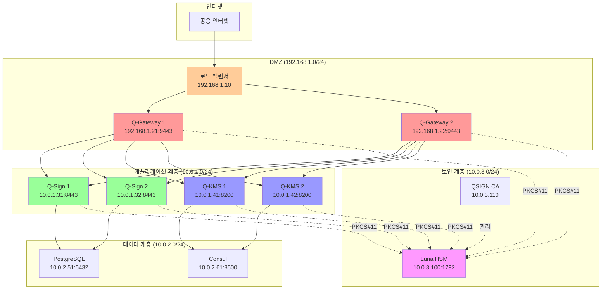

### Kubernetes 배포

#### Namespace 생성

```yaml
# qsign-namespace.yaml
apiVersion: v1
kind: Namespace
metadata:
  name: qsign
  labels:
    name: qsign
    security: quantum-safe
```

#### Q-Gateway Deployment

```yaml
# q-gateway-deployment.yaml
apiVersion: apps/v1
kind: Deployment
metadata:
  name: q-gateway
  namespace: qsign
  labels:
    app: q-gateway
    component: api-gateway
spec:
  replicas: 3
  selector:
    matchLabels:
      app: q-gateway
  template:
    metadata:
      labels:
        app: q-gateway
    spec:
      containers:
      - name: apisix
        image: apache/apisix:2.15.0
        ports:
        - containerPort: 9080
          name: http
        - containerPort: 9443
          name: https
        - containerPort: 9180
          name: admin
        env:
        - name: APISIX_STAND_ALONE
          value: "false"
        volumeMounts:
        - name: config
          mountPath: /usr/local/apisix/conf/config.yaml
          subPath: config.yaml
        - name: qtls-plugin
          mountPath: /usr/local/apisix/apisix/plugins/qtls.lua
          subPath: qtls.lua
        - name: certs
          mountPath: /etc/qsign/certs
          readOnly: true
        - name: hsm-client
          mountPath: /usr/safenet/lunaclient
        resources:
          requests:
            memory: "2Gi"
            cpu: "1000m"
          limits:
            memory: "4Gi"
            cpu: "2000m"
        livenessProbe:
          httpGet:
            path: /apisix/status
            port: 9080
          initialDelaySeconds: 30
          periodSeconds: 10
        readinessProbe:
          httpGet:
            path: /apisix/status
            port: 9080
          initialDelaySeconds: 10
          periodSeconds: 5
      volumes:
      - name: config
        configMap:
          name: q-gateway-config
      - name: qtls-plugin
        configMap:
          name: qtls-plugin
      - name: certs
        secret:
          secretName: q-gateway-certs
      - name: hsm-client
        hostPath:
          path: /usr/safenet/lunaclient
          type: Directory
---
apiVersion: v1
kind: Service
metadata:
  name: q-gateway
  namespace: qsign
spec:
  type: NodePort
  selector:
    app: q-gateway
  ports:
  - name: https
    port: 9443
    targetPort: 9443
    nodePort: 30443
  - name: admin
    port: 9180
    targetPort: 9180
    nodePort: 30180
---
apiVersion: v1
kind: ConfigMap
metadata:
  name: q-gateway-config
  namespace: qsign
data:
  config.yaml: |
    # APISIX 구성 (이전 섹션 참조)
    # ...
```

#### Q-Sign Deployment

```yaml
# q-sign-deployment.yaml
apiVersion: apps/v1
kind: Deployment
metadata:
  name: q-sign
  namespace: qsign
  labels:
    app: q-sign
    component: authentication
spec:
  replicas: 2
  selector:
    matchLabels:
      app: q-sign
  template:
    metadata:
      labels:
        app: q-sign
    spec:
      containers:
      - name: keycloak
        image: quay.io/keycloak/keycloak:23.0.0
        args:
        - start
        - --optimized
        ports:
        - containerPort: 8443
          name: https
        env:
        - name: KC_DB
          value: postgres
        - name: KC_DB_URL
          value: jdbc:postgresql://postgres.qsign.svc.cluster.local:5432/keycloak
        - name: KC_DB_USERNAME
          valueFrom:
            secretKeyRef:
              name: postgres-credentials
              key: username
        - name: KC_DB_PASSWORD
          valueFrom:
            secretKeyRef:
              name: postgres-credentials
              key: password
        - name: KC_HOSTNAME
          value: auth.qsign.local
        - name: KEYCLOAK_ADMIN
          value: admin
        - name: KEYCLOAK_ADMIN_PASSWORD
          valueFrom:
            secretKeyRef:
              name: keycloak-admin
              key: password
        volumeMounts:
        - name: qtls-provider
          mountPath: /opt/keycloak/providers/keycloak-qtls-provider-1.0.0.jar
          subPath: keycloak-qtls-provider-1.0.0.jar
        - name: certs
          mountPath: /opt/keycloak/conf/certs
          readOnly: true
        - name: config
          mountPath: /opt/keycloak/conf/keycloak.conf
          subPath: keycloak.conf
        - name: hsm-client
          mountPath: /usr/safenet/lunaclient
        resources:
          requests:
            memory: "4Gi"
            cpu: "2000m"
          limits:
            memory: "8Gi"
            cpu: "4000m"
        livenessProbe:
          httpGet:
            path: /health/live
            port: 8443
            scheme: HTTPS
          initialDelaySeconds: 60
          periodSeconds: 30
        readinessProbe:
          httpGet:
            path: /health/ready
            port: 8443
            scheme: HTTPS
          initialDelaySeconds: 30
          periodSeconds: 10
      volumes:
      - name: qtls-provider
        configMap:
          name: qtls-provider
      - name: certs
        secret:
          secretName: q-sign-certs
      - name: config
        configMap:
          name: q-sign-config
      - name: hsm-client
        hostPath:
          path: /usr/safenet/lunaclient
          type: Directory
---
apiVersion: v1
kind: Service
metadata:
  name: q-sign
  namespace: qsign
spec:
  type: NodePort
  selector:
    app: q-sign
  ports:
  - name: https
    port: 8443
    targetPort: 8443
    nodePort: 30843
```

#### Q-KMS Deployment

```yaml
# q-kms-deployment.yaml
apiVersion: apps/v1
kind: StatefulSet
metadata:
  name: q-kms
  namespace: qsign
  labels:
    app: q-kms
    component: key-management
spec:
  serviceName: q-kms
  replicas: 3
  selector:
    matchLabels:
      app: q-kms
  template:
    metadata:
      labels:
        app: q-kms
    spec:
      containers:
      - name: vault
        image: hashicorp/vault:1.15.0
        ports:
        - containerPort: 8200
          name: api
        - containerPort: 8201
          name: cluster
        env:
        - name: VAULT_ADDR
          value: https://127.0.0.1:8200
        - name: VAULT_CACERT
          value: /etc/vault/tls/qsign-root-ca.pem
        - name: VAULT_API_ADDR
          value: https://$(POD_NAME).q-kms.qsign.svc.cluster.local:8200
        - name: POD_NAME
          valueFrom:
            fieldRef:
              fieldPath: metadata.name
        volumeMounts:
        - name: config
          mountPath: /vault/config
        - name: certs
          mountPath: /etc/vault/tls
          readOnly: true
        - name: plugins
          mountPath: /vault/plugins
        - name: data
          mountPath: /vault/data
        - name: hsm-client
          mountPath: /usr/safenet/lunaclient
        command:
        - vault
        - server
        - -config=/vault/config/config.hcl
        resources:
          requests:
            memory: "2Gi"
            cpu: "1000m"
          limits:
            memory: "4Gi"
            cpu: "2000m"
        securityContext:
          capabilities:
            add:
            - IPC_LOCK
        livenessProbe:
          httpGet:
            path: /v1/sys/health?standbyok=true
            port: 8200
            scheme: HTTPS
          initialDelaySeconds: 60
          periodSeconds: 30
        readinessProbe:
          httpGet:
            path: /v1/sys/health?standbyok=true&perfstandbyok=true
            port: 8200
            scheme: HTTPS
          initialDelaySeconds: 30
          periodSeconds: 10
      volumes:
      - name: config
        configMap:
          name: q-kms-config
      - name: certs
        secret:
          secretName: q-kms-certs
      - name: plugins
        configMap:
          name: vault-plugins
      - name: hsm-client
        hostPath:
          path: /usr/safenet/lunaclient
          type: Directory
  volumeClaimTemplates:
  - metadata:
      name: data
    spec:
      accessModes: [ "ReadWriteOnce" ]
      storageClassName: "fast-ssd"
      resources:
        requests:
          storage: 10Gi
---
apiVersion: v1
kind: Service
metadata:
  name: q-kms
  namespace: qsign
spec:
  clusterIP: None
  selector:
    app: q-kms
  ports:
  - name: api
    port: 8200
    targetPort: 8200
  - name: cluster
    port: 8201
    targetPort: 8201
---
apiVersion: v1
kind: Service
metadata:
  name: q-kms-external
  namespace: qsign
spec:
  type: NodePort
  selector:
    app: q-kms
  ports:
  - name: api
    port: 8200
    targetPort: 8200
    nodePort: 30820
```

### 네트워크 정책

```yaml
# network-policy.yaml
apiVersion: networking.k8s.io/v1
kind: NetworkPolicy
metadata:
  name: q-gateway-policy
  namespace: qsign
spec:
  podSelector:
    matchLabels:
      app: q-gateway
  policyTypes:
  - Ingress
  - Egress
  ingress:
  - from:
    - podSelector: {}
    ports:
    - protocol: TCP
      port: 9443
    - protocol: TCP
      port: 9180
  egress:
  - to:
    - podSelector:
        matchLabels:
          app: q-sign
    ports:
    - protocol: TCP
      port: 8443
  - to:
    - podSelector:
        matchLabels:
          app: q-kms
    ports:
    - protocol: TCP
      port: 8200
  - to:
    - namespaceSelector: {}
    ports:
    - protocol: TCP
      port: 53  # DNS
---
apiVersion: networking.k8s.io/v1
kind: NetworkPolicy
metadata:
  name: q-sign-policy
  namespace: qsign
spec:
  podSelector:
    matchLabels:
      app: q-sign
  policyTypes:
  - Ingress
  - Egress
  ingress:
  - from:
    - podSelector:
        matchLabels:
          app: q-gateway
    ports:
    - protocol: TCP
      port: 8443
  egress:
  - to:
    - podSelector:
        matchLabels:
          app: postgres
    ports:
    - protocol: TCP
      port: 5432
  - to:
    - namespaceSelector: {}
    ports:
    - protocol: TCP
      port: 53  # DNS
---
apiVersion: networking.k8s.io/v1
kind: NetworkPolicy
metadata:
  name: q-kms-policy
  namespace: qsign
spec:
  podSelector:
    matchLabels:
      app: q-kms
  policyTypes:
  - Ingress
  - Egress
  ingress:
  - from:
    - podSelector:
        matchLabels:
          app: q-gateway
    ports:
    - protocol: TCP
      port: 8200
  - from:
    - podSelector:
        matchLabels:
          app: q-kms
    ports:
    - protocol: TCP
      port: 8201  # 클러스터 포트
  egress:
  - to:
    - podSelector:
        matchLabels:
          app: consul
    ports:
    - protocol: TCP
      port: 8500
  - to:
    - namespaceSelector: {}
    ports:
    - protocol: TCP
      port: 53  # DNS
```

---

## 모니터링 및 로깅

### Prometheus 메트릭 수집

#### Prometheus 구성

```yaml
# prometheus-config.yaml
global:
  scrape_interval: 15s
  evaluation_interval: 15s

scrape_configs:
  # Q-Gateway 메트릭
  - job_name: 'q-gateway'
    scheme: https
    tls_config:
      ca_file: /etc/prometheus/certs/qsign-root-ca.pem
      cert_file: /etc/prometheus/certs/prometheus-cert.pem
      key_file: /etc/prometheus/certs/prometheus-key.pem
    static_configs:
    - targets:
      - gateway1.qsign.local:9091
      - gateway2.qsign.local:9091
    relabel_configs:
    - source_labels: [__address__]
      target_label: instance
      regex: '([^:]+).*'
      replacement: '${1}'

  # Q-Sign 메트릭
  - job_name: 'q-sign'
    scheme: https
    metrics_path: '/metrics'
    tls_config:
      ca_file: /etc/prometheus/certs/qsign-root-ca.pem
      cert_file: /etc/prometheus/certs/prometheus-cert.pem
      key_file: /etc/prometheus/certs/prometheus-key.pem
    static_configs:
    - targets:
      - auth1.qsign.local:8443
      - auth2.qsign.local:8443

  # Q-KMS 메트릭
  - job_name: 'q-kms'
    scheme: https
    metrics_path: '/v1/sys/metrics'
    params:
      format: ['prometheus']
    bearer_token_file: /etc/prometheus/vault-token
    tls_config:
      ca_file: /etc/prometheus/certs/qsign-root-ca.pem
      cert_file: /etc/prometheus/certs/prometheus-cert.pem
      key_file: /etc/prometheus/certs/prometheus-key.pem
    static_configs:
    - targets:
      - vault1.qsign.local:8200
      - vault2.qsign.local:8200
      - vault3.qsign.local:8200

  # HSM 메트릭
  - job_name: 'hsm'
    static_configs:
    - targets:
      - hsm-monitor.qsign.local:9100
```

#### Grafana 대시보드

```json
{
  "dashboard": {
    "title": "QSIGN 시스템 개요",
    "panels": [
      {
        "title": "Q-TLS 핸드셰이크 성공률",
        "targets": [
          {
            "expr": "rate(qtls_handshake_success_total[5m]) / rate(qtls_handshake_total[5m]) * 100"
          }
        ],
        "type": "graph"
      },
      {
        "title": "Q-TLS 핸드셰이크 지연시간",
        "targets": [
          {
            "expr": "histogram_quantile(0.95, rate(qtls_handshake_duration_seconds_bucket[5m]))"
          }
        ],
        "type": "graph"
      },
      {
        "title": "HSM 작업 성공률",
        "targets": [
          {
            "expr": "rate(qtls_hsm_operation_success_total[5m]) / rate(qtls_hsm_operation_total[5m]) * 100"
          }
        ],
        "type": "graph"
      },
      {
        "title": "KYBER1024 작업",
        "targets": [
          {
            "expr": "rate(qtls_kyber_encapsulate_total[5m])",
            "legendFormat": "캡슐화"
          },
          {
            "expr": "rate(qtls_kyber_decapsulate_total[5m])",
            "legendFormat": "역캡슐화"
          }
        ],
        "type": "graph"
      },
      {
        "title": "DILITHIUM3 작업",
        "targets": [
          {
            "expr": "rate(qtls_dilithium_sign_total[5m])",
            "legendFormat": "서명"
          },
          {
            "expr": "rate(qtls_dilithium_verify_total[5m])",
            "legendFormat": "검증"
          }
        ],
        "type": "graph"
      }
    ]
  }
}
```

### 로깅 아키텍처

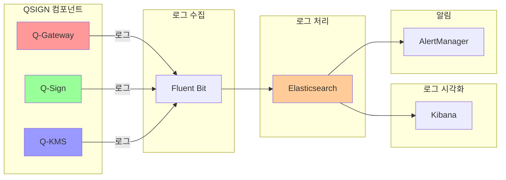

#### Fluent Bit 구성

```yaml
# fluent-bit-config.yaml
apiVersion: v1
kind: ConfigMap
metadata:
  name: fluent-bit-config
  namespace: qsign
data:
  fluent-bit.conf: |
    [SERVICE]
        Flush        5
        Daemon       Off
        Log_Level    info
        Parsers_File parsers.conf

    [INPUT]
        Name              tail
        Path              /var/log/containers/*q-gateway*.log
        Parser            docker
        Tag               qsign.gateway
        Refresh_Interval  5
        Mem_Buf_Limit     5MB
        Skip_Long_Lines   On

    [INPUT]
        Name              tail
        Path              /var/log/containers/*q-sign*.log
        Parser            docker
        Tag               qsign.auth
        Refresh_Interval  5
        Mem_Buf_Limit     5MB
        Skip_Long_Lines   On

    [INPUT]
        Name              tail
        Path              /var/log/containers/*q-kms*.log
        Parser            docker
        Tag               qsign.kms
        Refresh_Interval  5
        Mem_Buf_Limit     5MB
        Skip_Long_Lines   On

    [FILTER]
        Name                parser
        Match               qsign.*
        Key_Name            log
        Parser              json
        Preserve_Key        On
        Reserve_Data        On

    [FILTER]
        Name                record_modifier
        Match               qsign.*
        Record              cluster qsign-production
        Record              environment production

    [OUTPUT]
        Name            es
        Match           qsign.*
        Host            elasticsearch.qsign.local
        Port            9200
        Index           qsign-logs
        Type            _doc
        Logstash_Format On
        Logstash_Prefix qsign
        Retry_Limit     5
        TLS             On
        TLS_Verify      On
        TLS_CA          /etc/fluent-bit/certs/qsign-root-ca.pem
        TLS_Cert        /etc/fluent-bit/certs/fluent-bit-cert.pem
        TLS_Key         /etc/fluent-bit/certs/fluent-bit-key.pem

  parsers.conf: |
    [PARSER]
        Name   json
        Format json
        Time_Key time
        Time_Format %Y-%m-%dT%H:%M:%S.%LZ

    [PARSER]
        Name        docker
        Format      json
        Time_Key    time
        Time_Format %Y-%m-%dT%H:%M:%S.%LZ
```

### 보안 이벤트 모니터링

```bash
# 보안 이벤트 감시 스크립트
sudo tee /etc/qsign/scripts/security-monitor.sh > /dev/null <<'EOF'
#!/bin/bash

# 로그 파일
GATEWAY_LOG="/var/log/qsign/gateway.log"
AUTH_LOG="/var/log/qsign/auth.log"
KMS_LOG="/var/log/qsign/kms.log"
ALERT_LOG="/var/log/qsign/security-alerts.log"

# 보안 이벤트 감지
detect_security_events() {
    # 1. 실패한 핸드셰이크 (5분 내 10회 이상)
    FAILED_HANDSHAKES=$(grep "QTLS_ERROR_HANDSHAKE_FAILED" $GATEWAY_LOG | \
        grep -c "$(date -d '5 minutes ago' '+%Y-%m-%d %H:%M')")

    if [ $FAILED_HANDSHAKES -gt 10 ]; then
        echo "$(date): ALERT - 과도한 핸드셰이크 실패: $FAILED_HANDSHAKES" >> $ALERT_LOG
        # Slack 알림
        curl -X POST -H 'Content-type: application/json' \
            --data "{\"text\":\"QSIGN ALERT: 과도한 핸드셰이크 실패 감지\"}" \
            $SLACK_WEBHOOK_URL
    fi

    # 2. 인증서 검증 실패
    CERT_FAILURES=$(grep "QTLS_ERROR_CERT_VERIFY_FAILED" $GATEWAY_LOG | \
        grep -c "$(date '+%Y-%m-%d')")

    if [ $CERT_FAILURES -gt 5 ]; then
        echo "$(date): ALERT - 인증서 검증 실패: $CERT_FAILURES" >> $ALERT_LOG
    fi

    # 3. HSM 연결 실패
    HSM_FAILURES=$(grep "QTLS_ERROR_HSM_NOT_AVAILABLE" $GATEWAY_LOG $AUTH_LOG $KMS_LOG | \
        grep -c "$(date '+%Y-%m-%d %H:%M')")

    if [ $HSM_FAILURES -gt 0 ]; then
        echo "$(date): CRITICAL - HSM 연결 실패 감지!" >> $ALERT_LOG
        # 긴급 알림
        curl -X POST -H 'Content-type: application/json' \
            --data "{\"text\":\"QSIGN CRITICAL: HSM 연결 실패!\"}" \
            $SLACK_WEBHOOK_URL
    fi

    # 4. 비정상 암호화 작업
    CRYPTO_ERRORS=$(grep "QTLS_ERROR_DECAPSULATION\|QTLS_ERROR_VERIFICATION" $KMS_LOG | \
        grep -c "$(date '+%Y-%m-%d %H')")

    if [ $CRYPTO_ERRORS -gt 20 ]; then
        echo "$(date): ALERT - 과도한 암호화 오류: $CRYPTO_ERRORS" >> $ALERT_LOG
    fi

    # 5. 인증 실패
    AUTH_FAILURES=$(grep "authentication failed" $AUTH_LOG | \
        grep -c "$(date -d '10 minutes ago' '+%Y-%m-%d %H:%M')")

    if [ $AUTH_FAILURES -gt 30 ]; then
        echo "$(date): ALERT - 과도한 인증 실패 (무차별 대입 공격?): $AUTH_FAILURES" >> $ALERT_LOG
    fi
}

# 메트릭 수집
collect_metrics() {
    # Prometheus 메트릭 업데이트
    echo "qsign_security_handshake_failures $FAILED_HANDSHAKES" > /var/lib/prometheus/node-exporter/security.prom
    echo "qsign_security_cert_failures $CERT_FAILURES" >> /var/lib/prometheus/node-exporter/security.prom
    echo "qsign_security_hsm_failures $HSM_FAILURES" >> /var/lib/prometheus/node-exporter/security.prom
    echo "qsign_security_crypto_errors $CRYPTO_ERRORS" >> /var/lib/prometheus/node-exporter/security.prom
    echo "qsign_security_auth_failures $AUTH_FAILURES" >> /var/lib/prometheus/node-exporter/security.prom
}

# 실행
detect_security_events
collect_metrics
EOF

sudo chmod +x /etc/qsign/scripts/security-monitor.sh

# Cron 등록 (매 분)
echo "* * * * * /etc/qsign/scripts/security-monitor.sh" | sudo crontab -
```

---

## 트러블슈팅

### 일반적인 문제 및 해결

#### 1. Q-TLS 핸드셰이크 실패

**증상:**
```
ERROR: QTLS_ERROR_HANDSHAKE_FAILED
Failed to establish Q-TLS connection
```

**원인 및 해결:**

```bash
# 1. 인증서 체인 확인
openssl verify -CAfile /etc/qsign/ca/root/certs/root-ca.crt \
    -untrusted /etc/qsign/ca/intermediate/certs/tls-ca.crt \
    /etc/qsign/ca/certs/gateway-cert.pem

# 2. 인증서 만료 확인
openssl x509 -in /etc/qsign/ca/certs/gateway-cert.pem -noout -dates

# 3. 알고리즘 지원 확인
qtls-test --check-algorithms

# 4. HSM 연결 확인
/usr/safenet/lunaclient/bin/vtl verify

# 5. 네트워크 연결 확인
nc -zv gateway.qsign.local 9443

# 6. 로그 확인
tail -f /var/log/qsign/gateway.log | grep HANDSHAKE
```

#### 2. HSM 연결 실패

**증상:**
```
ERROR: QTLS_ERROR_HSM_NOT_AVAILABLE
Failed to initialize PKCS#11 library
```

**원인 및 해결:**

```bash
# 1. PKCS#11 라이브러리 확인
ls -l /usr/lib/libCryptoki2_64.so

# 2. HSM 네트워크 연결 확인
/usr/safenet/lunaclient/bin/vtl verify

# 3. 파티션 등록 확인
/usr/safenet/lunaclient/bin/vtl assignPartition -list

# 4. HSM 서버 연결 테스트
ping -c 3 hsm.qsign.local
nc -zv hsm.qsign.local 1792

# 5. 로그 확인
journalctl -u qtls-gateway -f | grep HSM

# 6. HSM 재등록
/usr/safenet/lunaclient/bin/vtl addServer -n hsm.qsign.local -i <HSM-IP>
/usr/safenet/lunaclient/bin/vtl assignPartition -n qsign-partition
```

#### 3. 인증서 검증 실패

**증상:**
```
ERROR: QTLS_ERROR_CERT_VERIFY_FAILED
Certificate verification failed: unable to get local issuer certificate
```

**원인 및 해결:**

```bash
# 1. CA 번들 확인
cat /etc/qsign/ca/certs/qsign-ca-bundle.pem

# 2. 시스템 신뢰 저장소 업데이트
sudo cp /etc/qsign/ca/root/certs/root-ca.crt \
    /usr/local/share/ca-certificates/qsign-root-ca.crt
sudo update-ca-certificates

# 3. OCSP 응답 확인
openssl ocsp \
    -CAfile /etc/qsign/ca/root/certs/root-ca.crt \
    -issuer /etc/qsign/ca/intermediate/certs/tls-ca.crt \
    -cert /etc/qsign/ca/certs/gateway-cert.pem \
    -url http://ocsp.qsign.local \
    -resp_text

# 4. CRL 확인
openssl crl -in /etc/qsign/ca/crl/qsign-tls-ca.crl -noout -text

# 5. 인증서 체인 완전성 확인
openssl verify -verbose -CAfile /etc/qsign/ca/certs/qsign-ca-bundle.pem \
    /etc/qsign/ca/certs/gateway-cert.pem
```

#### 4. 성능 저하

**증상:**
```
Q-TLS handshake taking > 5 seconds
High CPU usage on Q-Gateway
```

**원인 및 해결:**

```bash
# 1. 시스템 리소스 확인
top -p $(pgrep -f apisix)
free -h
df -h

# 2. HSM 성능 확인
/usr/safenet/lunaclient/bin/cmu performance

# 3. 연결 풀 확인
ss -tan | grep :9443 | wc -l

# 4. 프로파일링 활성화
qtls-profile --enable --output /tmp/qtls-profile.dat

# 5. 캐시 설정 최적화
# config.yaml 수정
plugin_attr:
  qtls:
    session_cache_size: 10000
    session_timeout: 7200

# 6. 로드 밸런싱 확인
curl http://127.0.0.1:9180/apisix/admin/upstreams \
    -H 'X-API-KEY: edd1c9f034335f136f87ad84b625c8f1'
```

#### 5. Keycloak 인증 실패

**증상:**
```
Authentication failed: Unable to verify client certificate
```

**원인 및 해결:**

```bash
# 1. Keycloak 로그 확인
tail -f /opt/keycloak/data/log/keycloak.log

# 2. 클라이언트 인증서 확인
openssl x509 -in /path/to/client-cert.pem -noout -text

# 3. Q-TLS 프로바이더 상태 확인
/opt/keycloak/bin/kcadm.sh get serverinfo \
    -r qsign \
    --fields providers

# 4. 데이터베이스 연결 확인
psql -h localhost -U keycloak -d keycloak -c "SELECT 1;"

# 5. Realm 설정 확인
/opt/keycloak/bin/kcadm.sh get realms/qsign

# 6. Keycloak 재시작
sudo systemctl restart keycloak
```

#### 6. Vault 봉인 문제

**증상:**
```
Vault is sealed
Error: Vault is in standby mode
```

**원인 및 해결:**

```bash
# 1. Vault 상태 확인
vault status

# 2. HSM 봉인 확인
/usr/safenet/lunaclient/bin/cmu list | grep vault-master-key

# 3. Vault 봉인 해제 (자동 HSM 봉인 사용 시 불필요)
# HSM이 정상이면 Vault가 자동으로 봉인 해제됨

# 4. HA 상태 확인
vault operator raft list-peers

# 5. 로그 확인
journalctl -u vault -f

# 6. Consul 백엔드 확인
consul kv get -recurse vault/

# 7. Vault 재시작
sudo systemctl restart vault
```

### 진단 도구

#### Q-TLS 진단 스크립트

```bash
sudo tee /etc/qsign/scripts/qtls-diagnose.sh > /dev/null <<'EOF'
#!/bin/bash

echo "=== QSIGN Q-TLS 진단 도구 ==="
echo ""

# 1. Q-TLS 라이브러리 확인
echo "1. Q-TLS 라이브러리 확인"
ldconfig -p | grep libqtls
pkg-config --modversion qtls
echo ""

# 2. HSM 연결 확인
echo "2. HSM 연결 확인"
/usr/safenet/lunaclient/bin/vtl verify
echo ""

# 3. 인증서 확인
echo "3. 인증서 확인"
for cert in /etc/qsign/ca/certs/*.pem; do
    echo "  $cert:"
    openssl x509 -in $cert -noout -subject -issuer -dates
done
echo ""

# 4. 서비스 상태 확인
echo "4. 서비스 상태 확인"
systemctl status apisix --no-pager | head -5
systemctl status keycloak --no-pager | head -5
systemctl status vault --no-pager | head -5
echo ""

# 5. 네트워크 포트 확인
echo "5. 네트워크 포트 확인"
ss -tlnp | grep -E "9443|8443|8200"
echo ""

# 6. 최근 오류 확인
echo "6. 최근 오류 확인 (마지막 10개)"
grep "ERROR" /var/log/qsign/*.log | tail -10
echo ""

# 7. HSM 키 확인
echo "7. HSM 키 확인"
/usr/safenet/lunaclient/bin/cmu list | grep -E "Private Key|Public Key"
echo ""

# 8. 메트릭 확인
echo "8. 메트릭 확인"
if [ -f /var/lib/prometheus/node-exporter/qtls.prom ]; then
    cat /var/lib/prometheus/node-exporter/qtls.prom
fi
echo ""

echo "=== 진단 완료 ==="
EOF

sudo chmod +x /etc/qsign/scripts/qtls-diagnose.sh
```

#### 연결 테스트 도구

```bash
sudo tee /etc/qsign/scripts/test-connection.sh > /dev/null <<'EOF'
#!/bin/bash

if [ -z "$1" ]; then
    echo "Usage: $0 <component>"
    echo "Components: gateway, auth, vault"
    exit 1
fi

COMPONENT=$1
CA_CERT="/etc/qsign/ca/root/certs/root-ca.crt"

case $COMPONENT in
    gateway)
        URL="https://gateway.qsign.local:9443/apisix/status"
        ;;
    auth)
        URL="https://auth.qsign.local:8443/health"
        ;;
    vault)
        URL="https://vault.qsign.local:8200/v1/sys/health"
        ;;
    *)
        echo "Unknown component: $COMPONENT"
        exit 1
        ;;
esac

echo "=== Q-TLS 연결 테스트: $COMPONENT ==="
echo ""

# 1. TLS 핸드셰이크 테스트
echo "1. TLS 핸드셰이크 테스트"
openssl s_client -connect $(echo $URL | sed 's|https://||' | sed 's|/.*||') \
    -CAfile $CA_CERT \
    -showcerts < /dev/null 2>&1 | grep -A 5 "Verify return code"
echo ""

# 2. HTTP 요청 테스트
echo "2. HTTP 요청 테스트"
curl -v --cacert $CA_CERT $URL
echo ""

# 3. 인증서 체인 확인
echo "3. 인증서 체인 확인"
openssl s_client -connect $(echo $URL | sed 's|https://||' | sed 's|/.*||') \
    -CAfile $CA_CERT \
    -showcerts < /dev/null 2>&1 | \
    awk '/BEGIN CERTIFICATE/,/END CERTIFICATE/' | \
    openssl x509 -noout -subject -issuer
echo ""

echo "=== 테스트 완료 ==="
EOF

sudo chmod +x /etc/qsign/scripts/test-connection.sh
```

### 로그 분석

```bash
# 핸드셰이크 실패 분석
grep "QTLS_ERROR_HANDSHAKE_FAILED" /var/log/qsign/gateway.log | \
    awk '{print $1, $2}' | sort | uniq -c | sort -rn

# 가장 많이 실패하는 클라이언트 IP
grep "HANDSHAKE_FAILED" /var/log/qsign/gateway.log | \
    awk '{print $NF}' | sort | uniq -c | sort -rn | head -10

# HSM 작업 통계
grep "HSM" /var/log/qsign/*.log | \
    grep -oP "QTLS_\w+" | sort | uniq -c | sort -rn

# 성능 분석
grep "handshake_duration" /var/log/qsign/gateway.log | \
    awk '{sum+=$NF; count++} END {print "Average:", sum/count, "ms"}'
```

---

## 부록

### A. 참고 문서

- [Q-TLS API 레퍼런스](/home/user/QSIGN/Q-TLS/docs/API-REFERENCE.md)
- [Q-TLS 배포 가이드](/home/user/QSIGN/Q-TLS/docs/DEPLOYMENT-GUIDE.md)
- [Q-TLS 보안 가이드](/home/user/QSIGN/Q-TLS/docs/SECURITY.md)
- [Q-TLS 성능 가이드](/home/user/QSIGN/Q-TLS/docs/PERFORMANCE.md)
- [NIST PQC Standards](https://csrc.nist.gov/projects/post-quantum-cryptography)
- [Apache APISIX Documentation](https://apisix.apache.org/docs/)
- [Keycloak Documentation](https://www.keycloak.org/documentation)
- [HashiCorp Vault Documentation](https://www.vaultproject.io/docs)
- [Thales Luna HSM Documentation](https://thalesdocs.com/gphsm/)

### B. 용어집

| 용어 | 설명 |
|------|------|
| PQC | Post-Quantum Cryptography (양자 후 암호화) |
| KYBER1024 | NIST 표준화 양자 내성 KEM 알고리즘 (ML-KEM-1024) |
| DILITHIUM3 | NIST 표준화 양자 내성 서명 알고리즘 (ML-DSA-65) |
| HSM | Hardware Security Module (하드웨어 보안 모듈) |
| PKCS#11 | 암호화 토큰 인터페이스 표준 |
| KEM | Key Encapsulation Mechanism (키 캡슐화 메커니즘) |
| ECDHE | Elliptic Curve Diffie-Hellman Ephemeral (타원곡선 디피-헬만 임시) |
| OCSP | Online Certificate Status Protocol (온라인 인증서 상태 프로토콜) |
| CRL | Certificate Revocation List (인증서 폐기 목록) |
| FIPS | Federal Information Processing Standards (연방 정보 처리 표준) |

### C. 연락처

- **기술 지원**: support@qsign.org
- **보안 문제**: security@qsign.org
- **일반 문의**: info@qsign.org
- **GitHub**: https://github.com/QSIGN/Q-TLS

---

**문서 버전**: 1.0.0
**최종 업데이트**: 2025년 1월 16일
**작성자**: QSIGN Project Team
