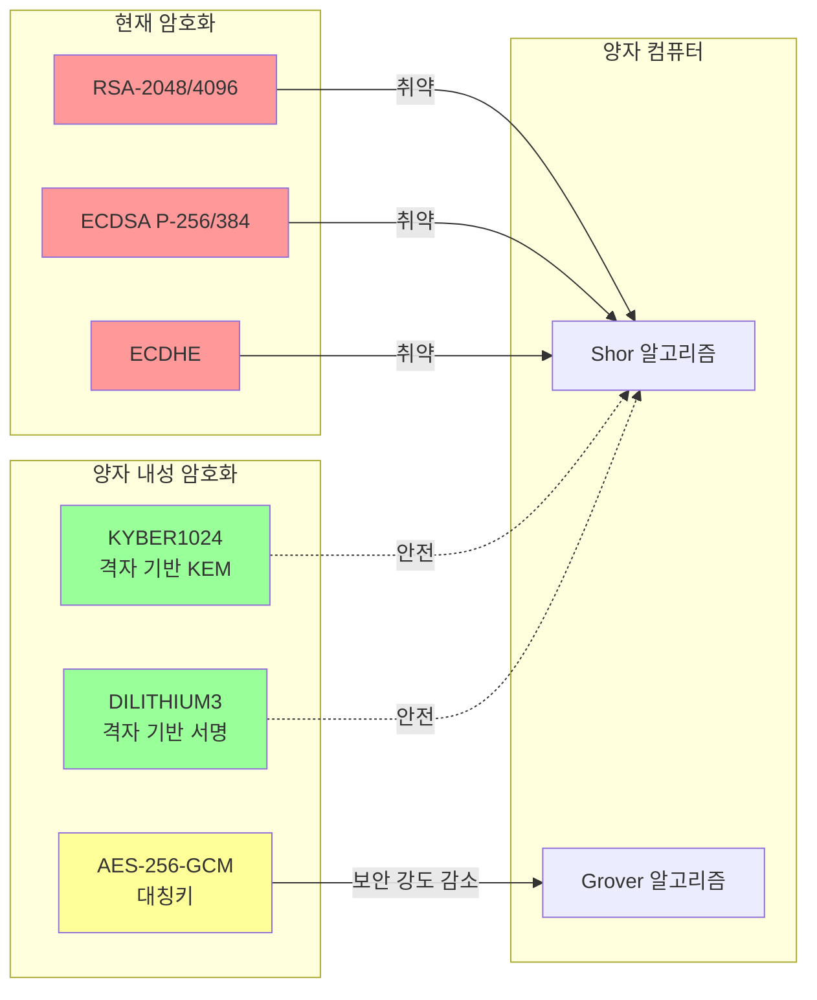
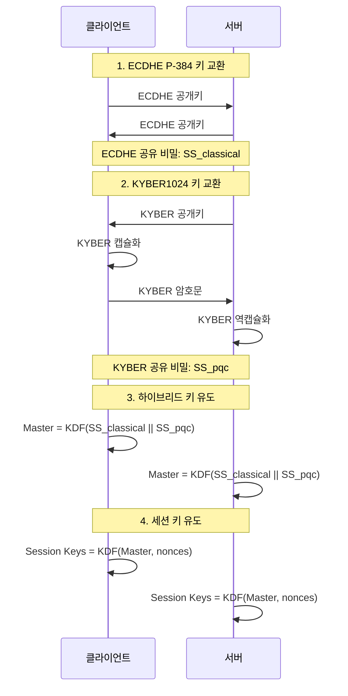
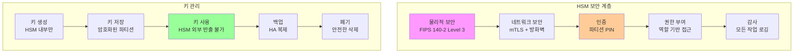
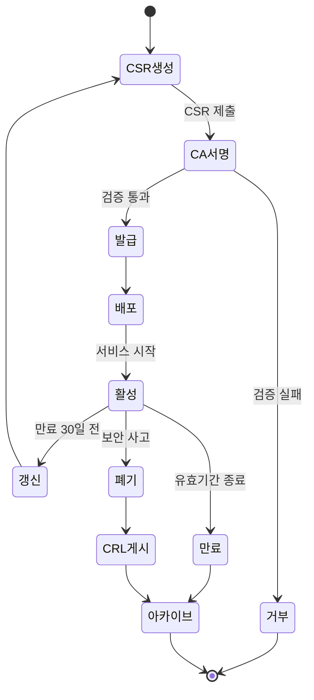
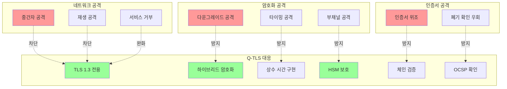

# Q-TLS 보안 가이드

## 목차

1. [양자 내성 암호화 개요](#양자-내성-암호화-개요)
2. [FIPS 140-2 준수](#fips-140-2-준수)
3. [HSM 보안 모범 사례](#hsm-보안-모범-사례)
4. [인증서 관리](#인증서-관리)
5. [취약점 대응](#취약점-대응)

---

## 양자 내성 암호화 개요

### 양자 위협



### 하이브리드 암호화 전략

Q-TLS는 **하이브리드 암호화**를 사용하여 현재와 미래의 위협 모두로부터 보호합니다:

1. **기존 알고리즘**: 현재 공격자로부터 보호
2. **PQC 알고리즘**: 양자 컴퓨터로부터 보호
3. **결합 방식**: XOR 또는 KDF 기반 키 결합

#### 하이브리드 키 교환



#### 키 유도 함수 (KDF)

```c
// 하이브리드 마스터 시크릿 유도
int derive_hybrid_master_secret(
    const uint8_t *classical_secret,    // ECDHE 공유 비밀 (48 바이트)
    const uint8_t *pqc_secret,          // KYBER 공유 비밀 (32 바이트)
    const uint8_t *client_random,       // 클라이언트 난수 (32 바이트)
    const uint8_t *server_random,       // 서버 난수 (32 바이트)
    uint8_t *master_secret)             // 출력 (48 바이트)
{
    // 입력 결합: classical || pqc || client_random || server_random
    uint8_t ikm[48 + 32 + 32 + 32];
    memcpy(ikm, classical_secret, 48);
    memcpy(ikm + 48, pqc_secret, 32);
    memcpy(ikm + 80, client_random, 32);
    memcpy(ikm + 112, server_random, 32);

    // HKDF-SHA384로 마스터 시크릿 유도
    return HKDF(EVP_sha384(),
                ikm, sizeof(ikm),
                NULL, 0,  // salt
                (const unsigned char *)"qtls hybrid master secret", 25,  // info
                master_secret, 48);
}
```

### NIST 표준화 알고리즘

Q-TLS는 NIST에서 표준화한 PQC 알고리즘만 사용합니다:

| NIST 이름 | liboqs 이름 | Q-TLS 용도 | 보안 레벨 |
|----------|-------------|------------|----------|
| ML-KEM-1024 | KYBER1024 | 키 교환 | NIST Level 5 (AES-256 상당) |
| ML-DSA-65 | DILITHIUM3 | 디지털 서명 | NIST Level 3 (AES-192 상당) |

#### 보안 강도 비교

| 알고리즘 | 고전 보안 | 양자 보안 | NIST 레벨 |
|---------|----------|----------|-----------|
| RSA-2048 | ~112 비트 | ~0 비트 | - |
| RSA-4096 | ~128 비트 | ~0 비트 | - |
| ECDSA P-256 | ~128 비트 | ~0 비트 | - |
| ECDSA P-384 | ~192 비트 | ~0 비트 | - |
| AES-128 | 128 비트 | ~64 비트 | - |
| AES-256 | 256 비트 | ~128 비트 | - |
| **KYBER1024** | **~256 비트** | **~256 비트** | **Level 5** |
| **DILITHIUM3** | **~192 비트** | **~192 비트** | **Level 3** |

---

## FIPS 140-2 준수

### FIPS 모드 활성화

```bash
# 빌드 시 FIPS 모드 활성화
cmake .. -DFIPS_MODE=ON
make
sudo make install

# 실행 시 FIPS 모드 확인
qtls-version --fips
# 출력: Q-TLS 1.0.0 (FIPS mode: enabled)
```

### FIPS 140-2 요구사항

| 요구사항 | Q-TLS 구현 |
|---------|-----------|
| **암호화 모듈** | OpenSSL FIPS 모듈 + liboqs |
| **자체 테스트** | 시작 시 알고리즘 자가 진단 |
| **키 관리** | Luna HSM (FIPS 140-2 Level 3) |
| **물리적 보안** | HSM 내 키 저장 |
| **운영 환경** | 승인된 운영 모드만 허용 |
| **감사** | 모든 암호화 작업 로깅 |

### FIPS 승인 알고리즘

#### 승인된 알고리즘

- **대칭 암호화**: AES-128-GCM, AES-256-GCM
- **해시**: SHA-256, SHA-384, SHA-512
- **HMAC**: HMAC-SHA256, HMAC-SHA384, HMAC-SHA512
- **키 유도**: HKDF
- **난수 생성**: DRBG (CTR_DRBG, HASH_DRBG)

#### 비승인 알고리즘 (허용됨)

- **PQC KEM**: KYBER1024 (NIST 표준화됨)
- **PQC 서명**: DILITHIUM3 (NIST 표준화됨)

**참고**: NIST PQC 알고리즘은 FIPS 승인 프로세스를 진행 중이며, Q-TLS는 표준이 최종화되는 대로 업데이트됩니다.

### FIPS 자체 테스트

```c
// FIPS 자체 테스트 구현
int qtls_fips_self_test(void)
{
    int ret = 0;

    // 1. AES-256-GCM 테스트
    ret |= test_aes_256_gcm();

    // 2. SHA-384 테스트
    ret |= test_sha384();

    // 3. HKDF 테스트
    ret |= test_hkdf();

    // 4. ECDHE P-384 테스트
    ret |= test_ecdhe_p384();

    // 5. RSA-4096 서명 테스트
    ret |= test_rsa_4096_sign();

    // 6. KYBER1024 테스트
    ret |= test_kyber1024();

    // 7. DILITHIUM3 테스트
    ret |= test_dilithium3();

    // 8. DRBG 테스트
    ret |= test_drbg();

    if (ret != 0) {
        fprintf(stderr, "FIPS self-test failed!\n");
        return QTLS_ERROR_CRYPTO_INIT;
    }

    printf("FIPS self-test passed\n");
    return QTLS_SUCCESS;
}
```

### FIPS 감사 로깅

```c
// FIPS 감사 로그 구조체
typedef struct {
    time_t timestamp;
    const char *operation;  // "SIGN", "VERIFY", "ENCRYPT", "DECRYPT", etc.
    const char *algorithm;  // "DILITHIUM3", "AES-256-GCM", etc.
    const char *key_id;     // HSM 키 식별자
    int result;             // 성공/실패
    const char *user;       // 사용자/프로세스
} qtls_audit_log_t;

// 감사 로그 기록
void qtls_audit_log(const qtls_audit_log_t *log)
{
    FILE *fp = fopen("/var/log/qtls/audit.log", "a");
    if (!fp) return;

    fprintf(fp, "%ld,%s,%s,%s,%d,%s\n",
        log->timestamp,
        log->operation,
        log->algorithm,
        log->key_id,
        log->result,
        log->user);

    fclose(fp);
}
```

---

## HSM 보안 모범 사례

### Luna HSM 보안 구성



### 키 생명주기 관리

#### 1. 키 생성

```bash
# HSM에서 DILITHIUM3 + RSA 하이브리드 키 생성
/usr/safenet/lunaclient/bin/cmu generatekeypair \
    -keyType=RSA \
    -modulusBits=4096 \
    -publicExponent=65537 \
    -sign=T \
    -verify=T \
    -labelpublic=server-rsa-pub \
    -labelprivate=server-rsa-priv \
    -extractable=F \
    -modifiable=F \
    -sensitive=T \
    -token

# Q-TLS CLI로 DILITHIUM3 키 생성
qtls-keygen \
    --hsm-token=qtls-server \
    --algorithm=dilithium3 \
    --label=server-dilithium3 \
    --extractable=false \
    --sensitive=true
```

**보안 원칙**:
- ✅ HSM 내부에서만 키 생성
- ✅ `extractable=false`: 키 추출 불가
- ✅ `sensitive=true`: 민감한 키로 표시
- ✅ `modifiable=false`: 키 속성 변경 불가
- ✅ `token`: 영구 저장 (세션 키 아님)

#### 2. 키 접근 제어

```bash
# HSM 파티션별 역할 생성
/usr/safenet/lunaclient/bin/lunacm << EOF
role login -name Partition SO -password <SO_password>
role createUser -name crypto_officer -password <CO_password>
role createUser -name crypto_user -password <CU_password>

# 암호화 담당자: 키 생성/삭제 권한
partition assignRole -role crypto_officer -partition qtls-server

# 암호화 사용자: 키 사용만 가능
partition assignRole -role crypto_user -partition qtls-server

role logout
EOF
```

#### 3. 키 순환

```bash
#!/bin/bash
# 키 순환 스크립트

OLD_KEY="server-dilithium3-2024"
NEW_KEY="server-dilithium3-2025"

echo "=== 키 순환 시작 ==="

# 1. 새 키 생성
qtls-keygen \
    --hsm-token=qtls-server \
    --algorithm=dilithium3 \
    --label=$NEW_KEY \
    --extractable=false

# 2. 새 인증서 발급
/etc/qsign/ca/issue-cert.sh server server.qsign.local

# 3. 구성 업데이트
sed -i "s/$OLD_KEY/$NEW_KEY/g" /etc/qtls/config/server.json

# 4. 서비스 재시작
systemctl reload qtls-server

# 5. 검증
sleep 5
curl --cacert /etc/qsign/ca/root/certs/root-ca.crt \
    https://server.qsign.local:8443/health

# 6. 구 키 비활성화 (30일 후 삭제 예약)
/usr/safenet/lunaclient/bin/cmu setAttribute \
    -label=$OLD_KEY \
    -modifiable=F \
    -token

# 삭제 작업 예약
echo "/usr/safenet/lunaclient/bin/cmu delete -label=$OLD_KEY" | \
    at now + 30 days

echo "=== 키 순환 완료 ==="
```

#### 4. 키 백업 (HA 복제)

```bash
# Primary HSM에서 HA 활성화
/usr/safenet/lunaclient/bin/vtl haAdmin \
    -partition qtls-server \
    -enable

# Backup HSM 추가
/usr/safenet/lunaclient/bin/vtl haAdmin \
    -group create \
    -label qtls-ha-group \
    -serialNum <primary-serial> \
    -partition qtls-server

/usr/safenet/lunaclient/bin/vtl haAdmin \
    -group addMember \
    -group qtls-ha-group \
    -serialNum <backup-serial> \
    -partition qtls-server-backup

# 동기화
/usr/safenet/lunaclient/bin/vtl haAdmin \
    -group synchronize \
    -group qtls-ha-group
```

#### 5. 키 폐기

```bash
# 안전한 키 삭제
/usr/safenet/lunaclient/bin/cmu delete \
    -label=compromised-key \
    -token

# 파티션 제로화 (모든 키 삭제)
/usr/safenet/lunaclient/bin/lunacm << EOF
partition zeroize -partition qtls-old-partition
EOF
```

### HSM 네트워크 보안

```bash
# 방화벽 규칙 (HSM 전용 VLAN)
sudo iptables -A INPUT -p tcp --dport 1792 -s 10.0.3.0/24 -j ACCEPT
sudo iptables -A INPUT -p tcp --dport 1792 -j DROP

# SELinux/AppArmor 정책
# HSM 라이브러리 접근 제한
sudo semanage fcontext -a -t lib_t "/usr/lib/libCryptoki2_64.so"
sudo restorecon -v /usr/lib/libCryptoki2_64.so
```

### HSM PIN 보안

```bash
# 환경 변수 대신 파일 사용
echo "my_secure_pin" | sudo tee /etc/qtls/secrets/hsm-pin
sudo chmod 400 /etc/qtls/secrets/hsm-pin
sudo chown qtls:qtls /etc/qtls/secrets/hsm-pin

# 애플리케이션에서 읽기
cat /etc/qtls/secrets/hsm-pin | qtls_hsm_login("qtls-server", -)
```

**보안 권고**:
- ❌ 코드에 하드코딩하지 않음
- ❌ 환경 변수에 저장하지 않음
- ✅ 파일 권한 400으로 제한
- ✅ Vault 같은 시크릿 관리 시스템 사용 권장

---

## 인증서 관리

### 인증서 수명주기



### 인증서 검증 체인

```c
// 인증서 검증 함수
int qtls_verify_certificate_chain(QTLS_X509 *cert, QTLS_X509_STORE *store)
{
    // 1. 기본 검증
    if (!cert || !store) {
        return QTLS_ERROR_NULL_POINTER;
    }

    // 2. 만료 시간 확인
    time_t now = time(NULL);
    if (now < cert->not_before || now > cert->not_after) {
        qtls_log(LOG_ERROR, "Certificate expired or not yet valid");
        return QTLS_ERROR_CERT_VERIFY_FAILED;
    }

    // 3. 발급자 확인
    QTLS_X509 *issuer = find_issuer(cert, store);
    if (!issuer) {
        qtls_log(LOG_ERROR, "Issuer not found in trust store");
        return QTLS_ERROR_CERT_VERIFY_FAILED;
    }

    // 4. 하이브리드 서명 검증
    // 4a. RSA 서명 검증
    if (!verify_rsa_signature(cert, issuer)) {
        qtls_log(LOG_ERROR, "RSA signature verification failed");
        return QTLS_ERROR_VERIFICATION;
    }

    // 4b. DILITHIUM3 서명 검증
    if (!verify_dilithium3_signature(cert, issuer)) {
        qtls_log(LOG_ERROR, "DILITHIUM3 signature verification failed");
        return QTLS_ERROR_VERIFICATION;
    }

    // 5. CRL 확인
    if (is_revoked(cert, get_crl(issuer))) {
        qtls_log(LOG_ERROR, "Certificate is revoked");
        return QTLS_ERROR_CERT_VERIFY_FAILED;
    }

    // 6. OCSP 확인 (선택사항)
    if (ocsp_enabled && !check_ocsp(cert, issuer)) {
        qtls_log(LOG_WARNING, "OCSP check failed");
        // OCSP는 soft-fail (계속 진행)
    }

    // 7. 재귀적으로 발급자 검증
    if (!is_root_ca(issuer)) {
        return qtls_verify_certificate_chain(issuer, store);
    }

    // 8. 루트 CA 신뢰 확인
    if (!is_trusted(issuer, store)) {
        qtls_log(LOG_ERROR, "Root CA is not trusted");
        return QTLS_ERROR_CERT_VERIFY_FAILED;
    }

    return QTLS_SUCCESS;
}
```

### OCSP 스테이플링

```c
// OCSP 스테이플링 구현
int qtls_get_ocsp_staple(QTLS_X509 *cert, QTLS_X509 *issuer,
                          uint8_t **staple, size_t *staple_len)
{
    // 1. OCSP 요청 생성
    OCSP_REQUEST *req = OCSP_REQUEST_new();
    OCSP_CERTID *id = OCSP_cert_to_id(NULL, cert->x509, issuer->x509);
    OCSP_request_add0_id(req, id);

    // 2. OCSP 서버 URL 가져오기
    const char *ocsp_url = get_ocsp_url(cert);
    if (!ocsp_url) {
        return QTLS_ERROR_GENERIC;
    }

    // 3. OCSP 요청 전송
    OCSP_RESPONSE *resp = send_ocsp_request(req, ocsp_url);
    if (!resp) {
        return QTLS_ERROR_SYSCALL;
    }

    // 4. OCSP 응답 검증
    int status = OCSP_response_status(resp);
    if (status != OCSP_RESPONSE_STATUS_SUCCESSFUL) {
        return QTLS_ERROR_VERIFICATION;
    }

    // 5. OCSP 응답 인코딩
    *staple_len = i2d_OCSP_RESPONSE(resp, staple);

    OCSP_REQUEST_free(req);
    OCSP_RESPONSE_free(resp);

    return QTLS_SUCCESS;
}
```

### 인증서 고정 (Certificate Pinning)

```c
// 공개키 핀 생성
void qtls_create_public_key_pin(QTLS_X509 *cert, char *pin, size_t pin_len)
{
    // 1. 공개키 추출
    EVP_PKEY *pkey = X509_get_pubkey(cert->x509);

    // 2. DER 인코딩
    unsigned char *der = NULL;
    int der_len = i2d_PUBKEY(pkey, &der);

    // 3. SHA-256 해시
    unsigned char hash[SHA256_DIGEST_LENGTH];
    SHA256(der, der_len, hash);

    // 4. Base64 인코딩
    EVP_EncodeBlock((unsigned char *)pin, hash, SHA256_DIGEST_LENGTH);

    EVP_PKEY_free(pkey);
    OPENSSL_free(der);
}

// 핀 검증
int qtls_verify_pin(QTLS_CONNECTION *conn, const char *expected_pin)
{
    QTLS_X509 *cert = qtls_get_peer_certificate(conn);
    if (!cert) {
        return 0;
    }

    char actual_pin[128];
    qtls_create_public_key_pin(cert, actual_pin, sizeof(actual_pin));

    return strcmp(actual_pin, expected_pin) == 0;
}

// 사용 예제
const char *EXPECTED_PIN = "47DEQpj8HBSa+/TImW+5JCeuQeRkm5NMpJWZG3hSuFU=";
if (!qtls_verify_pin(conn, EXPECTED_PIN)) {
    fprintf(stderr, "Certificate pin verification failed!\n");
    qtls_shutdown(conn);
    qtls_free(conn);
    return 1;
}
```

---

## 취약점 대응

### 보안 공격 벡터



### 다운그레이드 공격 방지

```c
// TLS 버전 협상
int qtls_negotiate_version(QTLS_CONNECTION *conn)
{
    // 1. TLS 1.3만 허용
    if (conn->client_version < QTLS_VERSION_1_3) {
        qtls_log(LOG_ERROR, "Client requested TLS version < 1.3");
        send_alert(conn, QTLS_ALERT_PROTOCOL_VERSION);
        return QTLS_ERROR_PROTOCOL_VERSION;
    }

    // 2. 하이브리드 PQC 필수 (옵션)
    if (conn->ctx->options & QTLS_OP_HYBRID_MODE) {
        if (!client_supports_pqc(conn)) {
            qtls_log(LOG_ERROR, "Client does not support PQC");
            send_alert(conn, QTLS_ALERT_UNSUPPORTED_EXTENSION);
            return QTLS_ERROR_UNSUPPORTED_ALGO;
        }
    }

    conn->version = QTLS_VERSION_1_3;
    return QTLS_SUCCESS;
}
```

### 타이밍 공격 방지

```c
// 상수 시간 비교 함수
int qtls_constant_time_compare(const void *a, const void *b, size_t len)
{
    const unsigned char *aa = a;
    const unsigned char *bb = b;
    unsigned char result = 0;

    for (size_t i = 0; i < len; i++) {
        result |= aa[i] ^ bb[i];
    }

    return result == 0;
}

// DILITHIUM3 서명 검증 (상수 시간)
int qtls_dilithium_verify_constant_time(const QTLS_DILITHIUM_KEY *key,
                                         const uint8_t *msg, size_t msg_len,
                                         const uint8_t *sig, size_t sig_len)
{
    // liboqs의 상수 시간 구현 사용
    return OQS_SIG_dilithium_3_verify(msg, msg_len, sig, sig_len,
                                       key->public_key);
}

// KYBER1024 역캡슐화 (상수 시간)
int qtls_kyber_decapsulate_constant_time(QTLS_KYBER_KEY *key)
{
    // liboqs의 상수 시간 구현 사용
    return OQS_KEM_kyber_1024_decaps(key->shared_secret,
                                      key->ciphertext,
                                      key->secret_key);
}
```

### 메모리 보안

```c
// 안전한 메모리 할당
void *qtls_secure_malloc(size_t size)
{
    void *ptr = malloc(size);
    if (!ptr) {
        return NULL;
    }

    // 메모리 잠금 (스왑 방지)
    if (mlock(ptr, size) != 0) {
        qtls_log(LOG_WARNING, "Failed to lock memory");
    }

    // 메모리 제로화
    memset(ptr, 0, size);

    return ptr;
}

// 안전한 메모리 해제
void qtls_secure_free(void *ptr, size_t size)
{
    if (!ptr) {
        return;
    }

    // 메모리 제로화 (컴파일러 최적화 방지)
    qtls_secure_zero(ptr, size);

    // 메모리 잠금 해제
    munlock(ptr, size);

    free(ptr);
}

// 상수 시간 메모리 제로화
void qtls_secure_zero(void *ptr, size_t len)
{
    volatile unsigned char *p = ptr;
    while (len--) {
        *p++ = 0;
    }
}
```

### 난수 생성

```c
// FIPS 승인 DRBG 사용
int qtls_random_bytes(uint8_t *buf, size_t len)
{
    // OpenSSL FIPS DRBG
    if (RAND_bytes(buf, len) != 1) {
        qtls_log(LOG_ERROR, "RAND_bytes failed");
        return QTLS_ERROR_CRYPTO_INIT;
    }

    return QTLS_SUCCESS;
}

// 엔트로피 추가
int qtls_add_entropy(const uint8_t *buf, size_t len)
{
    RAND_add(buf, len, len);
    return QTLS_SUCCESS;
}

// HSM 난수 사용 (선택사항)
int qtls_random_bytes_hsm(uint8_t *buf, size_t len)
{
    CK_SESSION_HANDLE session = get_hsm_session();
    CK_RV rv = C_GenerateRandom(session, buf, len);

    if (rv != CKR_OK) {
        qtls_log(LOG_ERROR, "HSM random generation failed");
        return QTLS_ERROR_HSM_OPERATION_FAILED;
    }

    return QTLS_SUCCESS;
}
```

### 보안 업데이트

#### 취약점 보고

보안 취약점을 발견한 경우:

1. **이메일**: security@qsign.org
2. **PGP 키**: https://qsign.org/security-pgp.asc
3. **응답 시간**: 48시간 이내
4. **패치 일정**: 심각도에 따라 1-30일

#### 보안 공지

Q-TLS 보안 공지는 다음에서 확인할 수 있습니다:

- **웹사이트**: https://qsign.org/security-advisories
- **메일링 리스트**: qtls-security-announce@qsign.org
- **RSS**: https://qsign.org/security.rss

#### 보안 체크리스트

```bash
# Q-TLS 보안 점검 스크립트
#!/bin/bash

echo "=== Q-TLS 보안 점검 ==="

# 1. 버전 확인
echo "1. Q-TLS 버전"
qtls-version

# 2. FIPS 모드 확인
echo "2. FIPS 모드"
qtls-version --fips

# 3. HSM 연결 확인
echo "3. HSM 연결"
/usr/safenet/lunaclient/bin/vtl verify

# 4. 인증서 만료 확인
echo "4. 인증서 만료일"
for cert in /etc/qtls/certs/*.pem; do
    echo "  $cert:"
    openssl x509 -in $cert -noout -enddate
done

# 5. CRL 업데이트 확인
echo "5. CRL 최종 업데이트"
for crl in /etc/qtls/crl/*.crl; do
    echo "  $crl:"
    openssl crl -in $crl -noout -lastupdate -nextupdate
done

# 6. 파일 권한 확인
echo "6. 파일 권한"
ls -l /etc/qtls/secrets/

# 7. 최근 보안 이벤트
echo "7. 최근 보안 이벤트"
grep -i "error\|fail\|attack" /var/log/qtls/security.log | tail -10

# 8. 암호화 라이브러리 버전
echo "8. 라이브러리 버전"
pkg-config --modversion liboqs openssl

echo "=== 점검 완료 ==="
```

---

## 부록

### 보안 참고 자료

- [NIST PQC Standardization](https://csrc.nist.gov/projects/post-quantum-cryptography)
- [FIPS 140-2 Standard](https://csrc.nist.gov/publications/detail/fips/140/2/final)
- [Thales Luna HSM Security Guide](https://thalesdocs.com/gphsm/)
- [OWASP TLS Cheat Sheet](https://cheatsheetseries.owasp.org/cheatsheets/Transport_Layer_Protection_Cheat_Sheet.html)

### 보안 연락처

- **보안 팀**: security@qsign.org
- **긴급 연락처**: +82-2-xxxx-xxxx
- **버그 바운티**: https://qsign.org/bug-bounty

---

**문서 버전**: 1.0.0
**최종 업데이트**: 2025년 1월 16일
**작성자**: QSIGN Security Team
